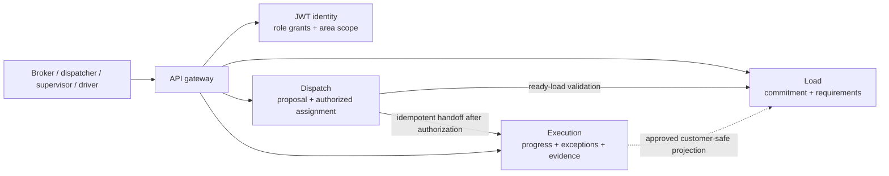

# TMS system architecture

This is the architecture of the trucking TMS study system, not a generic
backend template. We are defining and testing a realistic company model,
not documenting a customer deployment. The target services are not yet
implemented; repository/runtime status is tracked in the
[development roadmap](./README_NEXT_STEPS.md).

## Domain services and ownership

The product is divided into three deliberately selected domain services:

| Service | Owns | Authority |
| --- | --- | --- |
| **Load** | Ready transportation commitments, requirements and revisions, and any deliberately customer-safe load status projection | Source of truth for what work was committed and the requirements to fulfill it |
| **Dispatch** | Capacity proposals, assignment decisions and authorization history | Source of truth for who may authorize the capacity assigned to a load |
| **Execution** | Assigned movement, progress, exceptions, evidence, completion, and corrections | Source of truth for operational facts and delivery evidence |

Identity and workforce accounts own credentials and multi-role grants with
optional area scope. A grant does not by itself authorize access to every
load; services also enforce record ownership, assignment, and business
authority. See the [role model](./trucking/RESPONSIBILITIES.md).

Each domain service owns its data. Services communicate over validated
interfaces; direct reads/writes to another service's tables and distributed
transactions are not allowed.

## Main handoff

This shows ownership and business relationships, not a finalized protocol.
Select direct API calls, durable events, or a combination after defining
consistency, latency, recovery, and operator requirements. The assignment
handoff must make pending and failed states visible, prevent duplicate
executions, and provide safe retry/reconciliation.

## Assignment and automation

The initial assignment remains human-authorized: drivers and dispatchers
provide priorities and operational knowledge; the accountable
departure-area supervisor weighs those against the specific load's company
benefit and confirms one assignment. Matching, ranking, one-click approval,
capacity removal from competing candidate lists, preassignment, and
automatic assignment are later steps. Define eligibility, company objectives,
preference treatment, override behavior, and evaluation criteria before
implementing them.

## Repository implementation boundary

Retain only code serving this TMS model:

- Shared TypeScript runtime, validation, HTTP service, observability, and
  stable contract packages.
- API gateway, authentication, and user/workforce account capabilities,
  adapted to TMS role grants, area scope, and JWT access with revocable
  refresh sessions.
- PostgreSQL and local engineering infrastructure needed to develop and
  verify the domain services.

Load, Dispatch, and Execution are the planned product services. The
repository's retained implementation and infrastructure should support those
capabilities or the engineering practices needed to test them.

## Engineering constraints

- Validate untrusted input and service-to-service contracts at the receiving
  boundary. TypeScript types alone do not validate runtime data.
- Keep domain rules independent of Fastify, Prisma, and transport adapters
  where that separation improves testing and changeability.
- Use finite request deadlines, bounded retry, idempotency, and explicit
  failure states. Never report successful assignment or completion when a
  downstream effect is unknown.
- Record authority and evidence for assignments and corrections. Keep
  sensitive operational detail out of customer-facing projections.
- Add infrastructure only when an identified TMS workflow requires it and
  its failure modes can be tested.

For the company structure and flow, see the
[vision](./trucking/VISION.md), [responsibilities](./trucking/RESPONSIBILITIES.md),
[workflow](./trucking/WORKFLOW.md), and [first-slice charter](./trucking/MVP_START.md).
