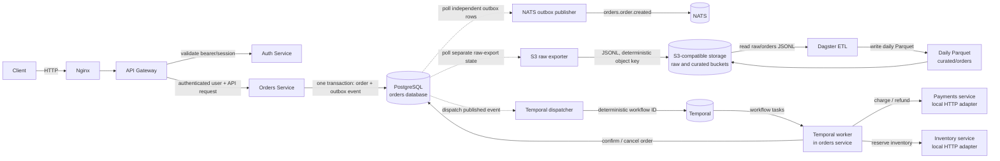
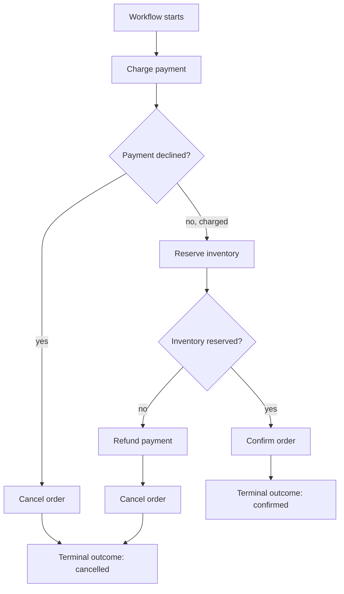

# What Has Been Built: A Guided System Walkthrough

This guide describes the implementation completed so far in plain language: what the starting point was, what changed, how the pieces communicate, what each request waits for, and what must be checked before treating the system as production-ready.

It describes the code in this repository, not a claim that every planned external service or production operation is complete.

## At a glance

The system now has two connected paths that begin with an authenticated order:

1. A synchronous API path saves the order and its event together.
2. Independent background workers publish that event to NATS, start a Temporal fulfillment workflow, and export the event to S3-compatible raw storage. Dagster can then turn raw events into daily Parquet data.

The key safety idea is that creating an order only waits for the order database transaction. It does **not** wait for NATS, object storage, Temporal, payment, or inventory.

## Before and after

| Area                  | Before this implementation                                                                                 | Now                                                                                                                                                                                                    |
| --------------------- | ---------------------------------------------------------------------------------------------------------- | ------------------------------------------------------------------------------------------------------------------------------------------------------------------------------------------------------ |
| Service lifecycle     | Services had startup and shutdown behavior distributed across entrypoints.                                 | Shared bootstrap and signal handling close listeners and dependent resources, aggregate cleanup failures, and enforce a bounded shutdown.                                                              |
| Orders                | The repository had service scaffolding and shared event concepts, but no completed user-scoped order flow. | The gateway authenticates order requests; the orders service validates input, scopes reads to the owner, and saves an order and its event atomically.                                                  |
| Event delivery        | No order-specific durable path connected persistence to downstream consumers.                              | The transactional outbox has separate retrying paths for NATS publication, Temporal workflow dispatch, and S3 raw export.                                                                              |
| Fulfillment           | Payment/inventory orchestration was not implemented.                                                       | Temporal runs the payment → inventory → confirm flow and refunds before cancelling when inventory is unavailable. Local HTTP services are included; production payment/inventory integrations are not. |
| Analytics data        | ETL was a planned direction, with no runnable order pipeline in the local stack.                           | Dagster validates order events, deduplicates deliveries, flattens items, and writes UTC-daily Zstandard Parquet partitions.                                                                            |
| Local end-to-end path | There was no runnable order-to-curated-data demonstration.                                                 | The local stack can create a real order, export its event to an S3-compatible raw bucket, and materialize it into Parquet.                                                                             |

## The main architecture



Dashed arrows from PostgreSQL are independent pollers. The outbox is their durable hand-off point; it is not one serial pipeline where a slow analytics export holds up the API or another delivery path.

### What each component is responsible for

| Component                       | Responsibility                                                                                                                                          |
| ------------------------------- | ------------------------------------------------------------------------------------------------------------------------------------------------------- |
| Nginx                           | Local edge proxy in the development stack.                                                                                                              |
| API Gateway                     | Validates the caller's session through the auth service, forwards requests, and adds the authenticated user ID for the orders service.                  |
| Auth Service                    | Validates the session/token used by gateway-protected routes.                                                                                           |
| Orders Service                  | Validates order requests, stores and returns owner-scoped orders, and runs the outbox publisher, S3 exporter, Temporal dispatcher, and Temporal worker. |
| Orders PostgreSQL database      | Owns order rows, item rows, and the transactional outbox, including independent retry/lock/completion state for each background delivery.               |
| NATS                            | Receives `orders.order.created` messages from the outbox publisher.                                                                                     |
| Temporal                        | Durably coordinates the fulfillment workflow and activity retries.                                                                                      |
| Payments and inventory services | Local HTTP services called by Temporal activities. They are development implementations, not production provider integrations.                          |
| S3-compatible storage           | Holds newline-delimited raw events and curated Parquet. Local development uses Moto, an in-memory S3-compatible mock.                                   |
| Dagster                         | Runs the partitioned ETL asset that turns raw order events into Parquet.                                                                                |

## What happens when someone places an order

```mermaid
sequenceDiagram
    actor Customer
    participant Edge as Nginx / API Gateway
    participant Auth as Auth Service
    participant Orders as Orders Service
    participant DB as Orders PostgreSQL
    participant NATS as NATS
    participant S3 as Raw bucket
    participant Temporal

    Customer->>Edge: POST /orders + bearer/session token
    Edge->>Auth: Validate session
    Auth-->>Edge: User identity
    Edge->>Orders: POST /orders + authenticated user ID
    Orders->>Orders: Validate items and correlation ID
    Orders->>DB: BEGIN; insert order, items, outbox event
    DB-->>Orders: COMMIT
    Orders-->>Edge: 201 Created
    Edge-->>Customer: 201 Created

    par Independent NATS delivery
        Orders->>DB: Claim NATS-pending outbox event
        Orders->>NATS: Publish orders.order.created
        Orders->>DB: Mark published after NATS flush
    and Independent raw-data export
        Orders->>DB: Claim raw-export-pending event
        Orders->>S3: PutObject to raw/orders/created_date=.../events/{outbox-id}.jsonl
        Orders->>DB: Mark raw export complete
    and Workflow dispatch
        Orders->>DB: Claim NATS-published, workflow-pending event
        Orders->>Temporal: Start order-fulfillment-{orderId}
        Orders->>DB: Mark workflow started
    end
```

The lower half is asynchronous and happens after the HTTP response may already have returned. In particular, the Temporal dispatcher currently waits for NATS publication state (`PUBLISHED`) before it starts a workflow. The raw export is separate and may finish before or after either of those paths.

## Fulfillment: what waits for what



- Temporal activities have a 30-second start-to-close timeout and exponential retries (1-second initial delay, up to 1 minute). The HTTP adapter also aborts an individual outbound request after 10 seconds.
- The HTTP adapter uses idempotency keys for charge, reserve, and refund requests. Compatible service implementations must honor those keys.
- HTTP 402 means payment declined; HTTP 409 means inventory unavailable. Those are business outcomes, not retryable transport failures.
- Network errors, HTTP 429, and HTTP 5xx are retryable. Other rejected responses and response-contract violations fail visibly as non-retryable workflow errors.
- Inventory failure does not cancel a charged order until the refund activity succeeds. This avoids reporting cancellation while payment remains captured.
- Payments and inventory are included in the local Compose stack and expose the HTTP contracts used by the workflow. External payment-provider integration and production-grade inventory sources remain out of scope.

## What the event pipeline does

1. **Commit:** `OrdersService.create` writes the order, items, and `order.created.v1` envelope in one PostgreSQL transaction.
2. **Publish:** the NATS outbox poller claims rows with a lock, publishes to `orders.order.created`, flushes the NATS connection, and marks success. Failures use exponential backoff; NATS delivery is marked failed after 10 attempts.
3. **Export:** a separate poller claims order-created events that have not been exported. It writes one newline-terminated JSON envelope per object to `raw/orders/created_date={UTC date}/events/{outbox UUID}.jsonl`. A retry uses the same object key. Export failures are logged and retried with backoff (capped at 60 seconds); raw export is not blocked by the NATS status.
4. **Dispatch:** once NATS delivery is marked published, another poller starts a workflow with the deterministic ID `order-fulfillment-{orderId}`. It retries a failed start, and duplicate-start responses count as already dispatched.
5. **Curate:** Dagster reads `.jsonl` objects from `raw/orders/`, validates matching order events, selects the chosen UTC day, deduplicates identical event IDs, flattens each item to a row, and writes Zstandard Parquet to `curated/orders/created_date={date}/orders.parquet`.

The Parquet row grain is **one order item**, not one order. The output columns are `event_id`, `order_id`, `user_id`, `product_id`, `quantity`, `order_created_at`, and `correlation_id`.

## Who waits for whom

| Action                  | It waits for                                                                                                              | It does not wait for                                                               |
| ----------------------- | ------------------------------------------------------------------------------------------------------------------------- | ---------------------------------------------------------------------------------- |
| `POST /orders`          | Gateway authentication, orders-service validation, and the PostgreSQL transaction committing the order plus outbox event. | NATS publication, S3, Temporal, payment, inventory, or Dagster.                    |
| NATS outbox poller      | PostgreSQL to claim rows and NATS publish/flush to finish.                                                                | S3 or Temporal.                                                                    |
| Raw S3 exporter         | PostgreSQL to claim rows and S3 `PutObject` to finish.                                                                    | NATS, Temporal, or Dagster.                                                        |
| Temporal dispatcher     | A row to be NATS-published, plus Temporal accepting the workflow start.                                                   | Completion of the workflow activities.                                             |
| Temporal workflow       | Payment response, then inventory response, then any required refund/cancel or final confirmation.                         | Dagster or raw export.                                                             |
| Dagster materialization | Reads from raw S3-compatible storage, validation/transformation, and the curated object write.                            | Orders API, NATS, or Temporal. It is started manually in the current sample setup. |
| Service shutdown        | Stop accepting requests, then run configured resource cleanup in order. Shutdown is bounded at 30 seconds.                | External business services becoming available.                                     |

This separation is important: analytics storage trouble should create a visible raw-export backlog, not make a customer wait for an object-store request during checkout.

## What changed in the code

### Service runtime hardening

- Shared lifecycle and shutdown behavior is in [`packages/common/src/bootstrap.ts`](../packages/common/src/bootstrap.ts) and [`packages/common/src/health.ts`](../packages/common/src/health.ts).
- Services register cleanup for the listener, background workers/clients, databases, and observability.
- `SIGTERM`/`SIGINT` initiate shutdown once; cleanup failures are aggregated and logged, and a timeout/failure leads to a non-zero exit.
- Compose gives the six HTTP app services a 40-second stop grace period; the
  shared shutdown timeout is 30 seconds. This is a budget, not proof of
  graceful worker/client shutdown; a previous Compose stop still needs a
  lifecycle investigation (see the roadmap).
- Structured logs and Prometheus metrics are implemented across selected HTTP services. All six HTTP services use the shared OpenTelemetry bootstrap and the local Compose configuration sends their OTLP/HTTP exports to the collector. The collector's current exporter writes traces to collector logs rather than a queryable trace store. For orders specifically, `/health` reports database, NATS, and Temporal status, while `/ready` checks only PostgreSQL; it does not currently report raw-export/S3 health.

### Orders API and persistence

- Order HTTP routes are in [`services/orders/src/interfaces/http/routes/orders.ts`](../services/orders/src/interfaces/http/routes/orders.ts); gateway forwarding/authentication is in [`services/api-gateway/src/interfaces/http/routes/orders.ts`](../services/api-gateway/src/interfaces/http/routes/orders.ts).
- Input uses strict validation: 1–100 items, non-empty product IDs, and integer quantities from 1 to 9999. Client prices are not accepted.
- `GET /orders` and `GET /orders/:id` scope database queries to the authenticated owner.
- Order and event persistence is in [`services/orders/src/app/orders.service.ts`](../services/orders/src/app/orders.service.ts).
- The schema is in [`services/orders/prisma/schema.prisma`](../services/orders/prisma/schema.prisma); migrations are in [`services/orders/prisma/migrations/`](../services/orders/prisma/migrations/).

### Durable background work

- NATS outbox delivery: [`services/orders/src/infrastructure/messaging/outbox-publisher.ts`](../services/orders/src/infrastructure/messaging/outbox-publisher.ts).
- S3 raw-event export: [`services/orders/src/infrastructure/messaging/outbox-raw-exporter.ts`](../services/orders/src/infrastructure/messaging/outbox-raw-exporter.ts) and [`services/orders/src/infrastructure/messaging/raw-event-object.ts`](../services/orders/src/infrastructure/messaging/raw-event-object.ts).
- Workflow dispatch and worker: [`services/orders/src/infrastructure/temporal/order-workflow-dispatcher.ts`](../services/orders/src/infrastructure/temporal/order-workflow-dispatcher.ts) and [`services/orders/src/infrastructure/temporal/order-workflow-worker.ts`](../services/orders/src/infrastructure/temporal/order-workflow-worker.ts).
- Workflow and HTTP activity contracts: [`services/orders/src/workflows/order-fulfillment.workflow.ts`](../services/orders/src/workflows/order-fulfillment.workflow.ts) and [`services/orders/src/infrastructure/temporal/order-fulfillment.activities.ts`](../services/orders/src/infrastructure/temporal/order-fulfillment.activities.ts).
- The orders outbox stores the request's W3C `traceparent` and `tracestate`
  with the event. NATS publish, raw export, Temporal start, and Temporal
  activities create spans from that parent; payment/inventory HTTP requests
  carry their activity span context. Baggage is excluded. NATS message headers
  are verified by the opt-in journey, but this repository has no application
  NATS consumer.
- NATS publication, raw export, and Temporal workflow start each stop
  automatic retries after 10 attempts and expose their terminal state through
  outbox metrics/alerts. A started workflow's Temporal activity retries are a
  separate policy and are not limited by that outbox cap.
- Completed-row retention is disabled by default. Setting
  `OUTBOX_RETENTION_DAYS` above zero enables an hourly sweep, at most 500 rows
  per pass, requiring NATS publication, Temporal start, and raw export to have
  completed. Raw S3 objects and Temporal histories are not deleted by this
  cleanup.

### Test organization

Tests live outside `src` so service builds compile application code only. Each
TypeScript package and service uses `tests/unit`, `tests/integration`, and
`tests/e2e`; folders beneath those categories can mirror the relevant source
area. Unit tests use in-memory or mocked dependencies, integration tests
exercise the users API against local PostgreSQL and Redis, and E2E tests
verify a running stack. `pnpm test` and `pnpm test:unit` run the
dependency-independent suite; `pnpm test:integration` runs database-backed
tests and requires the users schema to be migrated. `pnpm test:all` runs every
configured test and therefore needs the integration dependencies.

### Service source conventions

The HTTP services use the same top-level boundaries: `app` for use cases and
ports, `domain` for service-owned business models, `infrastructure` for
configuration and external adapters, and `interfaces/http` for controllers
and routes. Config is exposed from `src/infrastructure/config/index.ts`;
services with Prisma use `src/infrastructure/database/prisma.ts`; HTTP routes
live in `src/interfaces/http/routes/`. Domain-specific adapters stay in their
service rather than being generalized prematurely. Build scripts clear
`dist/` before compiling so removed or relocated source files cannot linger as
stale runtime entrypoints.

### ETL and local integration

- Dagster transformation and asset: [`services/etl/etl_project/transform.py`](../services/etl/etl_project/transform.py) and [`services/etl/etl_project/assets.py`](../services/etl/etl_project/assets.py).
- The development stack is in [`infra/docker-compose.dev.yml`](../infra/docker-compose.dev.yml). Moto supplies the local S3-compatible endpoint, and the init job creates `raw`/`curated` buckets and seeds example JSONL.
- Focused operating details: [`docs/etl.md`](./etl.md), [`docs/orders_workflow.md`](./orders_workflow.md), and [`docs/contracts.md`](./contracts.md).

### The opt-in order journey

The live integration check is in
[`services/orders/tests/e2e/order-journey.e2e.test.ts`](../services/orders/tests/e2e/order-journey.e2e.test.ts).
It is skipped by ordinary test runs and runs only when
`E2E_ORDER_JOURNEY=1` is set. The package command
`pnpm docker:order-journey` sets that flag and connects to the already-running
local stack; it does not start, stop, or rebuild containers.

The check registers a unique account, confirms unauthenticated access is
rejected, configures a payment method, and creates two orders. It subscribes to
NATS before each order so it can compare the delivered event with the database
outbox record. For both orders it waits for NATS publication, Temporal
dispatch, and raw export, then verifies the exact JSONL object in Moto.

| Scenario                         | Expected workflow result               | Database/API evidence                                           |
| -------------------------------- | -------------------------------------- | --------------------------------------------------------------- |
| One seeded coffee                | Completed                              | Payment `CHARGED`, one inventory reservation, order `confirmed` |
| 100 coffees, beyond seeded stock | Completed with `inventory_unavailable` | Payment `REFUNDED`, no reservation, order `cancelled`           |

The E2E Compose override enables a deterministic local Stripe adapter for
setup, charge, and refund calls. It does not bypass the payment service; it
replaces only the external Stripe boundary and never contacts Stripe. The
override uses `NODE_ENV=development` because the service image defaults to
production mode and deliberately rejects the fake adapter in production. The
default Compose configuration keeps the fake adapter off.

Payment catalog products are upserted at payment-service startup after Prisma
migrations. The E2E seed command separately recreates Moto buckets and sample
objects because Moto is in-memory. The integration test does not reset
Postgres volumes; its uniquely named account and order rows remain available
for later inspection.

### Following an HTTP request and background delivery

The shared HTTP bootstrap creates an HTTP request span. If HTTP
instrumentation has already supplied an active server span, the request span
is its child; otherwise the bootstrap explicitly extracts the incoming W3C
trace context as the parent. It adds the request span's trace ID and bounded
correlation ID to request logs and the corresponding response headers, and
records errors before ending the span. The gateway injects this request span
and correlation ID into its auth-session validation and `POST /orders`
requests, then passes the orders trace ID and correlation ID back to the
caller. The order journey test sends a known `traceparent` and checks that
the returned trace ID is the same ID.

The outbox then creates an intentional asynchronous boundary: its workers
poll independently after the HTTP request has committed. A live HTTP span
cannot safely represent all later retries, so the outbox stores the request's
W3C `traceparent`/`tracestate` and correlation ID. NATS publication and S3
export create child spans; Temporal start creates a child span and passes its
context in workflow input; activity spans inject their context into payment
and inventory HTTP calls. Correlation IDs remain the business-level join key
in each structured log. Baggage is deliberately excluded from durable storage.
The local collector logs spans but does not provide trace search, and the
repository has no application NATS consumer.

The orders `/metrics` endpoint computes bounded-cardinality signals from the
outbox table:

| Metric                                                    | Meaning                                                          |
| --------------------------------------------------------- | ---------------------------------------------------------------- |
| `orders_service_outbox_backlog_events{stage}`             | Unfinished work in the `nats`, `workflow`, or `raw_export` stage |
| `orders_service_outbox_oldest_backlog_age_seconds{stage}` | Age of the oldest unfinished event for that stage                |
| `orders_service_outbox_retry_events{stage}`               | Unfinished events already attempted at that stage                |
| `orders_service_outbox_failed_events`                     | NATS publications that exhausted their retry limit               |
| `orders_service_outbox_workflow_failed_events`            | Temporal workflow starts that exhausted their retry limit        |
| `orders_service_outbox_raw_export_failed_events`          | Raw-object exports that exhausted their retry limit              |

Prometheus scrapes all six HTTP services and alerts if any target is
unavailable, if any delivery stage is terminally failed, or if any
delivery-stage backlog remains older than five minutes for five minutes. The
overview dashboard includes service status, backlog size, oldest age, and
terminal-failure panels. These operational metrics complement `/ready` and
`/health`; they do not make S3 or Temporal delivery part of API readiness.

## What has actually been verified

## Current verification evidence (2026-09-30)

- The six HTTP service images were rebuilt individually. The full development
  stack started from those images without rebuilding; then the documented E2E
  Compose overlay was applied and the Moto buckets were reseeded. All services
  with health checks reported healthy, and `s3-mock-init` exited successfully.
- `pnpm test` passed: 80 unit tests across 25 files. The integration command
  passed 7 tests across 2 files against the isolated `users_test` database.
- The ETL Python suite passed all 5 tests using the dependencies in the
  existing Dagster image. Running `pnpm etl:test` directly on the host requires
  the ETL requirements to be installed in that host Python environment.
- `pnpm lint`, both Compose configuration checks, and
  `pnpm docker:service-contract` passed. The contract probe verified health,
  readiness, trace/correlation headers, and request/latency/error metrics for
  all six HTTP services.
- The live order journey passed its successful charge/reserve/confirm path and
  its insufficient-inventory refund/cancel compensation path. Run it with the
  E2E Compose overlay: the regular development configuration intentionally
  leaves fake Stripe disabled, while the E2E overlay replaces only the
  external Stripe boundary with deterministic local responses.
- One completed test event was used for scoped outbox drills. Each delivery
  stage was placed at its terminal attempt state, its Prometheus alert reached
  `firing`, and its documented one-stage requeue recovered that stage; all
  three alerts returned to `inactive`. Attempt counters were set to the
  configured limit to exercise terminal transitions; this did not simulate
  ten real dependency failures or measure the full retry/backoff schedule.
- A separate retention drill aged one completed test event beyond the
  configured window. With `OUTBOX_RETENTION_DAYS=3650`, the service logged
  pruning exactly one row; no other row was eligible. Retention was restored
  to `0`, and no named volumes were removed.
- A fresh SIGTERM drill found an orders-only startup race: if the signal
  arrived while Temporal was compiling its workflow bundle, the code requested
  worker shutdown before `Worker.run()` and the container exited `137`. The
  worker now enters `run()` before shutdown is requested in that race. A
  regression test reproduces the ordering, and the rebuilt orders container
  logged the worker reaching `STOPPED`, completed shutdown, and exited `0`
  with `OOMKilled=false`. The other five HTTP services also exited `0`; the
  stack was restarted and the service-contract probe and order journey passed
  afterward.

These checks cover the healthy path and controlled terminal-state/requeue
behavior. They do not simulate actual NATS, Temporal, or S3 outages, exercise
shutdown while a Temporal activity is actively draining, or stress the
500-row retention batch limit.

- Prometheus reported all six HTTP service targets up; payments/inventory down alerts and the order outbox rules were loaded. Grafana served the dashboard query including all six services. The orders backlog and failed-event gauges were zero after the journey, and the OTel collector logged exported spans.
- Nginx, Dagster, Prometheus, Grafana, and OTel collector were included in the full-stack run; all configured health checks passed. Temporal and the collector were running but have no Compose health check. Alert firing under a deliberately induced failure is still unverified, and the collector has no searchable trace store.
- A prior Compose stop produced exit code 137 for several app containers with Docker reporting `OOMKilled=false`; the gateway logged an aggregated cleanup failure and exited 1. This is an unresolved shutdown/lifecycle issue, not evidence of an OOM kill. The later E2E run itself remained healthy.
- A real order was submitted to the running orders service. Its event appeared in the raw bucket, and the database recorded raw export completion.
- Dagster materialized the date partition, and the resulting Parquet contained the new order item alongside the seeded rows.

For current setup instructions and commands, use [`README.md`](../README.md) and [`docs/etl.md`](./etl.md).

## What is not finished yet

- **Production payment/inventory integrations:** local payment and inventory HTTP services exist, but external provider integrations and production inventory sources are not included.
- **Notifications and shipping:** no notification or shipment workflow activities are implemented.
- **Automated ETL scheduling:** the sample Dagster asset is runnable, but the current local guide materializes a partition manually. There is no demonstrated production schedule, event trigger, or late-arriving-data policy.
- **Production object storage:** local Moto is in-memory; it is a test/dev compatibility layer, not durable storage. Restarting it discards buckets and objects until `s3-mock-init` runs again.
- **Production infrastructure and delivery:** CI/CD workflows, CDK stacks, production IAM/secrets/network policy, and deployment automation remain roadmap work.
- **Operational automation:** terminal NATS, workflow-start, and raw-export
  delivery signals now have separate metrics/alerts and the delivery requeue
  procedure is documented. A controlled database-state drill drove each
  outbox terminal metric and alert to firing, applied its one-stage requeue,
  and verified recovery. A disposable completed row also verified opt-in
  retention and was deleted; retention was restored to disabled afterward.
  These checks do not simulate dependency outages or stress the 500-row
  deletion bound. Temporal activity failure visibility and ETL run failures
  remain unverified.

## Assurances and checks to preserve

### Correctness and delivery

- Keep order and outbox insertion in the same database transaction.
- Keep each background integration independently retryable; never move an S3 or payment call into the request transaction.
- Preserve deterministic S3 keys, deterministic Temporal workflow IDs, and idempotency keys across retries.
- Monitor old/locked outbox rows and clear/repair failures deliberately; do not silently mark failed delivery as complete.
- Decide whether production NATS requires JetStream/durable consumers. The current local publisher uses the NATS publish/flush API; the transactional outbox does not by itself provide durable broker retention after the broker accepts a publish.
- Keep outbox retention disabled until its eligibility and batch bounds are
  verified. The opt-in outbox sweep does not delete raw objects or Temporal
  history; define separate archival/deletion policy before production scale.

### Security and privacy

- Expose the gateway, not the internal orders service. The orders service consumes `x-authenticated-user-id` as an internal trusted identity header; the gateway must authenticate callers and set that header itself.
- Keep local overrides in `.env`; Compose defaults remain development-only.
  Production secret-manager integration, credential rotation, and
  authenticated TLS endpoints remain future work.
- Restrict raw/curated bucket access by least privilege; order events contain user and purchase data. Define encryption, retention, and deletion policies.
- Keep public API validation, owner-scoped reads, and correlation/trace logging from exposing tokens or sensitive request bodies.

### Availability and operations

- Treat PostgreSQL as the source of truth for order creation and outbox retries.
- Keep health/readiness semantics explicit. Orders `/ready` checks PostgreSQL only, while `/health` includes NATS and Temporal but not S3 exporter lag or errors; neither endpoint alone is a complete outbox/S3 delivery signal.
- Use dashboards and alerts for retry age/count and ETL output freshness; logs alone are not an operational SLO.
- Keep shutdown bounded and verify that pollers stop cleanly and clients close when adding any new background worker.
- Compose's `exec node` command forwarding let five HTTP containers stop
  gracefully. The users container still exits `137` (`OOMKilled=false`) with
  no shutdown-handler logs, even with its rebuilt image; investigate this
  before claiming all-service graceful shutdown.
- Test object-store restart/reseed, S3 permission errors, prolonged dependency outage, duplicate delivery, and recovery after worker restarts.

## Vocabulary

- **Transactional outbox:** event data saved in the same commit as the business change; separate workers deliver it later.
- **Idempotent retry:** repeating an operation has the same effective result as performing it once. Stable object keys and remote idempotency keys support this.
- **Compensation:** a reverse business action, such as refunding a successful charge when inventory cannot be reserved.
- **Raw data:** immutable-ish source event records kept close to their original shape.
- **Curated data:** validated and transformed records shaped for analytics; here, Parquet rows of order items partitioned by UTC date.
- **Partition:** a date-scoped unit of Dagster work and a matching output path.
