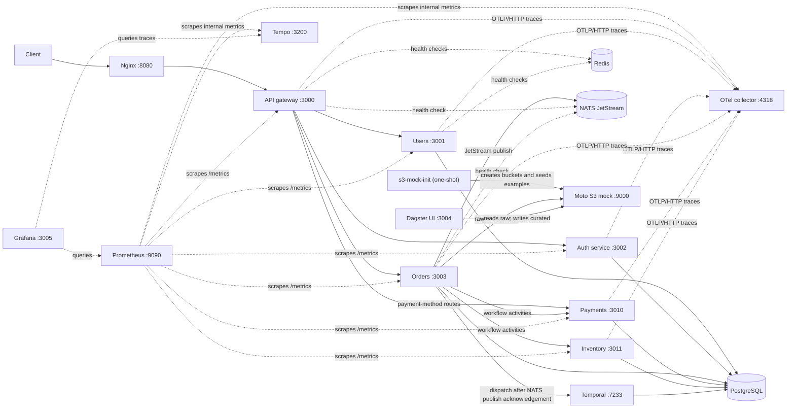
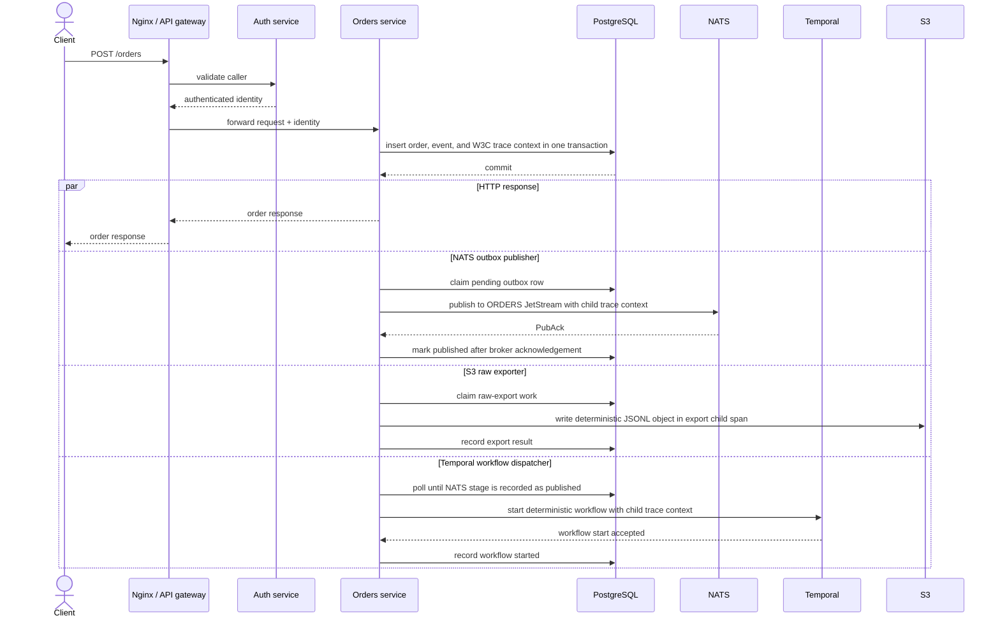
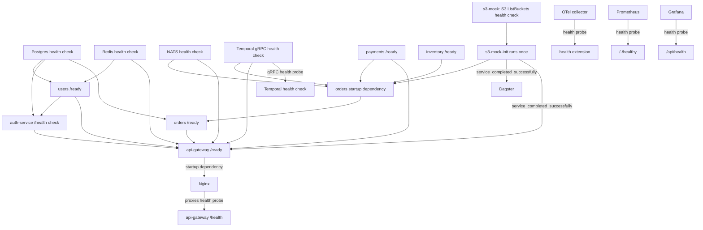
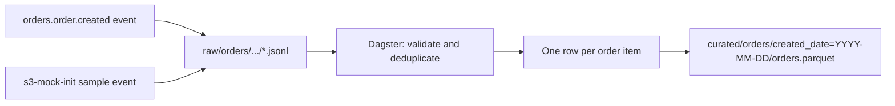

# System maps

These diagrams show the current local development stack described by
[`infra/docker-compose.dev.yml`](../infra/docker-compose.dev.yml). They are
kept deliberately separate from optional future learning topics: AWS services,
application NATS consumers, notifications, and shipping are not implied by
these local diagrams. They describe what is configured locally, not a
production deployment.

Editable Mermaid sources used by the diagram renderer are in
[`diagrams-src/`](./diagrams-src/). The SVG output directory is generated and
ignored by Git; the Mermaid in this document is the readable, versioned
reference.

## Local runtime topology

Solid arrows represent application or data dependencies in the local
configuration. Dotted arrows represent health or monitoring paths. Nginx
forwards application traffic only to the gateway; the gateway owns client
routes, while orders calls payments and inventory during workflow activities.
The arrows to PostgreSQL show database ownership/use, not database-initiated
calls. Prometheus scrapes the six HTTP services plus collector and Tempo
self-metrics. The collector exports traces to Tempo through a bounded
in-memory retry queue, and Grafana queries both data sources. Tempo retains
local traces for a bounded period; trace search and retention are not verified
by the hosted order-journey CI job. The shared HTTP metrics helper keeps
service metric names, labels, and response format consistent.

For `POST /orders`, W3C trace context is passed from the gateway to the orders
service and the downstream trace ID is returned to the caller. The order and
outbox row commit together; the outbox stores only W3C `traceparent` and
`tracestate` as durable context. Each later stage creates its own child span,
while the correlation ID remains the business-level join key. Baggage is not
persisted or published. Orders outbox gauges expose backlog, age, retries, and
terminal failures for each independent delivery stage to Prometheus.

## Order creation and asynchronous effects

The HTTP response and three pollers can proceed concurrently after the order
transaction commits; the request does not wait for outbox deliveries or
Dagster. The workflow dispatcher polls independently but does not start a
workflow until NATS publication is recorded as `PUBLISHED`. It does not wait
for raw export.
The outbox workers do not reuse the finished HTTP span: they create
independent child spans from the persisted W3C context.
Temporal receives its context in workflow input (the current Temporal client
contract does not provide generic workflow headers here). Activity HTTP calls
inject their child span context so payments and inventory can continue the
trace. The collector uses a bounded in-memory queue with retries and
Prometheus scrapes collector and Tempo self-metrics. Grafana/Tempo provide
local trace search, but the order-journey CI check does not verify trace
search or retention. There is no application NATS
consumer in this repository.

## Health, dependencies, and completion

The diagram shows the configured dependency and health-check relationships,
not a guarantee that every upstream remains healthy after startup. A Docker
health check reports only its specific probe: for example, the Moto `ListBuckets`
probe proves the S3 API responds, not that required buckets or seed objects
exist. The `s3-mock-init` one-shot job must exit `0`; it is not expected to
remain running or become healthy. Tempo has no Compose health check. See the
[operations guide](../infra/README.md) for exact coverage and probe limits.

## ETL data shape

The local S3-compatible service is Moto and is in-memory. Recreating it loses
its objects; the init job seeds sample data again. It is a development/testing
substitute, not durable production object storage.
