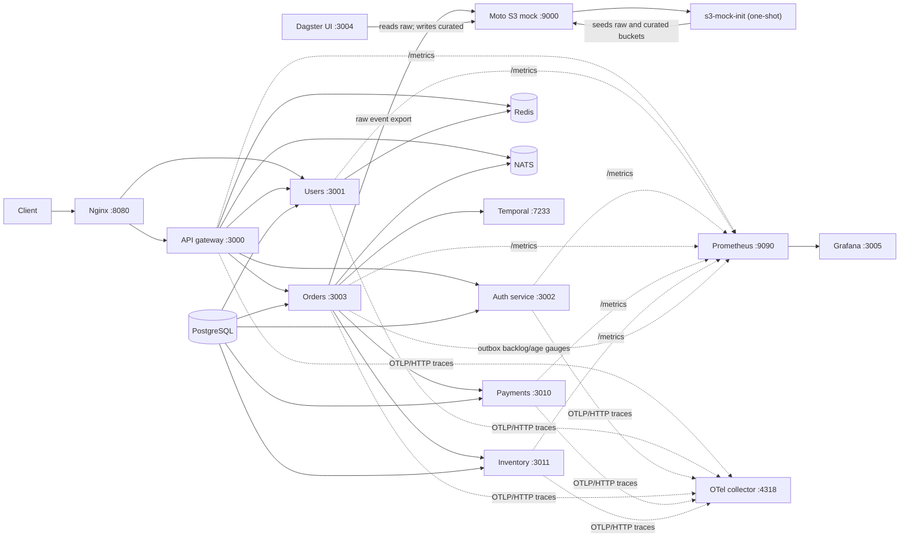
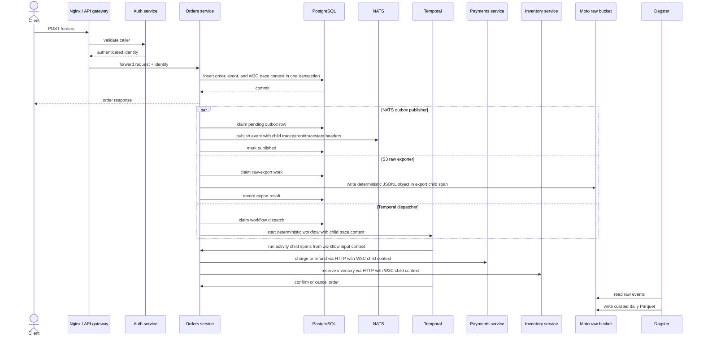
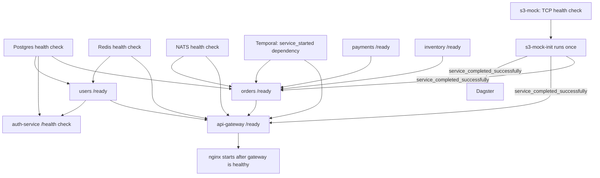
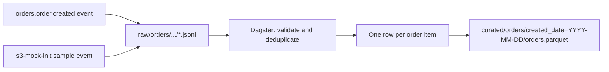

# System maps

These diagrams show the current local development stack described by
[`infra/docker-compose.dev.yml`](../infra/docker-compose.dev.yml). They are
kept deliberately separate from optional future learning topics: AWS services,
durable NATS consumers, notifications, and shipping are not implied by these
local diagrams. They describe what is configured locally, not a production
deployment.

Editable Mermaid sources used by the diagram renderer are in
[`diagrams-src/`](./diagrams-src/). The SVG output directory is generated and
ignored by Git; the Mermaid in this document is the readable, versioned
reference.

## Local runtime topology

Solid arrows represent application or data dependencies in the local
configuration. Dotted arrows represent configured monitoring paths; Prometheus
scrapes all six HTTP services, and the collector exports traces to Tempo.
Grafana can query both Prometheus metrics and Tempo traces. Tempo retains local
traces for a bounded period; this path is configured but not covered by the
hosted order-journey CI job. The shared HTTP metrics helper keeps metric names,
labels, and response format consistent across those services.

For `POST /orders`, W3C trace context is passed from the gateway to the orders
service and the downstream trace ID is returned to the caller. The order and
outbox row commit together; the outbox stores only W3C `traceparent` and
`tracestate` as durable context. Each later stage creates its own child span,
while the correlation ID remains the business-level join key. Baggage is not
persisted or published. Orders outbox gauges expose backlog, age, retries, and
terminal failures for each independent delivery stage to Prometheus.

## Order creation and asynchronous effects

The HTTP request waits for the order transaction, not for asynchronous
outbox deliveries or Dagster. The outbox workers do not reuse the finished
HTTP span: they create independent child spans from the persisted W3C context.
Temporal receives its context in workflow input (the current Temporal client
contract does not provide generic workflow headers here). Activity HTTP calls
inject their child span context so payments and inventory can continue the
trace. Grafana/Tempo provide local trace search, but the order-journey CI check
does not verify trace search or retention. There is no application NATS
consumer in this repository.

## Health, dependencies, and completion

`service_started` means only that the dependency's container process started.
It does not prove the dependency is ready. The Moto S3 mock uses a TCP listener
check before `s3-mock-init` runs; that check does not prove that S3 operations
or seed data are correct. `s3-mock-init` is expected to finish with exit code
`0`; it is not expected to remain running or become healthy.
Compose health checks are configured for only some services. See the
[operations guide](../infra/README.md) for the exact coverage and known limits.

## ETL data shape

The local S3-compatible service is Moto and is in-memory. Recreating it loses
its objects; the init job seeds sample data again. It is a development/testing
substitute, not durable production object storage.
