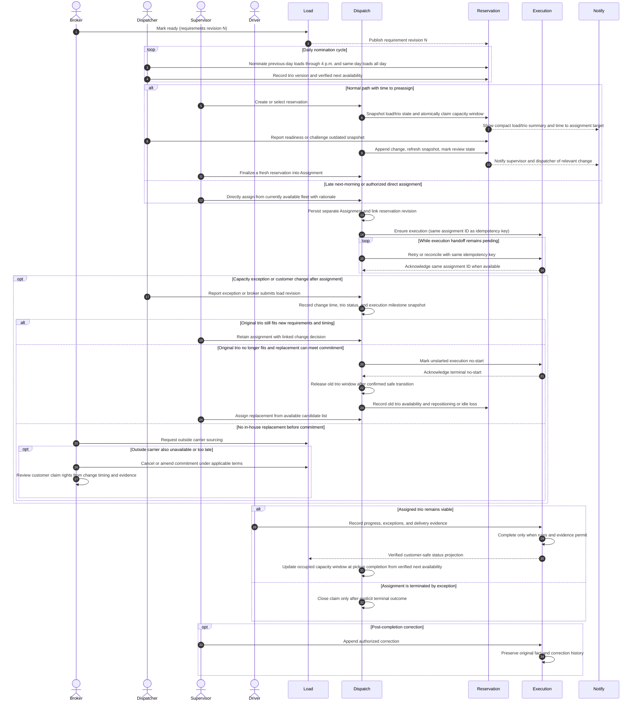
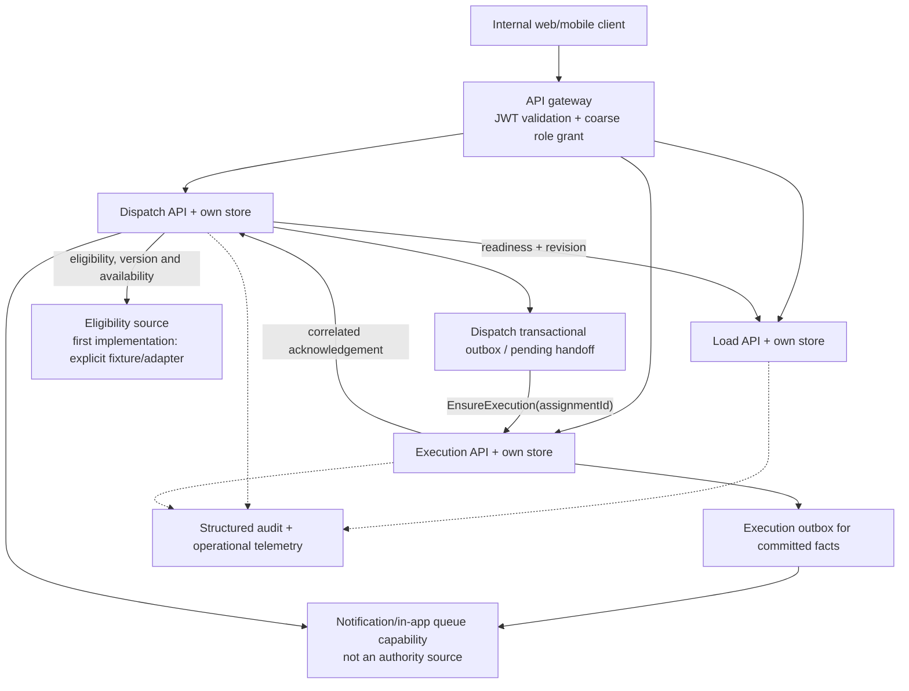
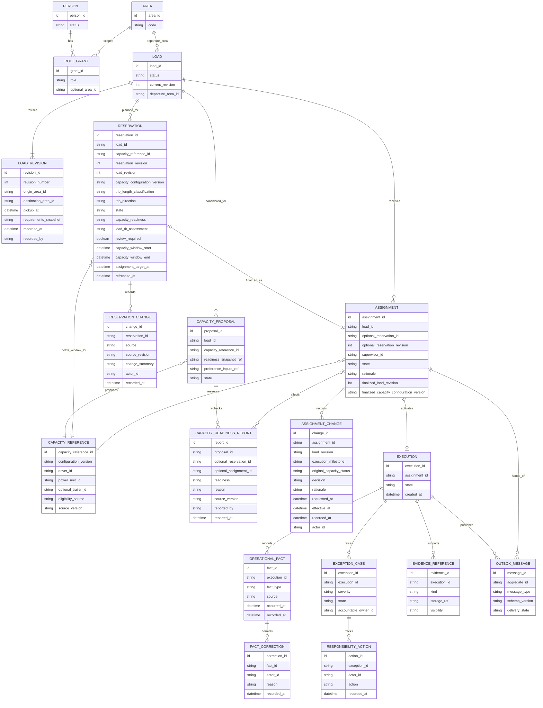

# First-slice workflow, contracts, and logical schema

This document describes the first executable business loop and how the
planned Load, Dispatch, and Execution contexts cooperate. It is a conceptual
design for the owner-defined TMS study, not a frozen API or database
migration. Resolve the decisions called out below before making a specific
schema or transport contract authoritative.

See the [system vision](./SYSTEM_VISION.md) for capability rings and
production envelope, the [company workflow](./WORKFLOW.md) for wider business
hypotheses, and the [MVP charter](./MVP_START.md) for first-slice acceptance
scenarios.

## Scope and preconditions

The slice begins after commercial intake and capacity data have produced a
controlled, ready-to-operate load and at least one candidate capacity record.
It does not book customer freight, source a carrier, calculate HOS, qualify a
driver, or prove equipment maintenance status. The source and provenance of
those prepared facts must be visible; a fixture or operator setup is not
production validation. In the wider workflow, the broker alone books or
declines any customer offer, including an offer received through another
broker; that decision requires no supervisor capacity review.

Ring 1 separates **Reservation** from **Assignment**. A Reservation is an
editable planning record and capacity-window claim, not a final operational
assignment. It holds a compact current snapshot of the load revision, trio
configuration, readiness/availability assessment, planned use window, and
time remaining to the assignment target. Relevant Load and trio updates
refresh that record and can notify the responsible supervisor and dispatcher.
The record keeps change history and can be revised or withdrawn with a
reason; it does not create a customer or employee penalty by itself.

Loads booked by the previous day receive dispatcher nomination priority
through 4:00 p.m. in the operating area's local time. Loads booked the same
day remain open for nominations throughout that day under the short-notice
handling path. After 4:00 p.m., a next-morning pickup that still needs
assignment is handled directly by the supervisor from currently available
capacity; do not wait for a missed nomination or reservation cycle. For
ordinary loads, the target is final assignment by the calendar day before
pickup. A load booked for pickup on the booking day is an emergency/extra-
short load and follows a distinct handling path whose detailed thresholds
remain to be defined. A supervisor may also bypass nomination priority and
Reservation for other reasoned direct assignments.

A trio may be nominated for a follow-on load after the current load's BOL is
uploaded and execution is in progress. The dispatcher records and verifies
the trio's next-available date/time; the next pickup cannot be earlier. For
a load picked up in LA that must return toward home, begin ranking/nominating
feasible return-home work as soon as the LA pickup and BOL are recorded,
even while the outbound load remains in transit. A supervisor may reserve
the follow-on when its pickup is compatible with the verified availability.
This is intentional directional planning, not a claim that the outbound load
is complete. Do not schedule many speculative trips ahead. A trio returning
from repair/recovery can be nominated after return-to-service and driver
readiness are checked.

The Ring 1 capacity unit is a stable driver + power unit + optional single
trailer configuration. Power-only capacity is valid; multiple trailers and
routine component swaps are out of scope. A dispatcher may reorganize trios
at the home base with driver agreement, but must record the new configuration
before nominating it. Each nomination references that configuration/version.
The dispatcher is responsible for checking actual driver/equipment readiness
against the recorded configuration; a mismatch is an operational report,
not a system-verified fact.

A nomination does not reserve capacity. When a supervisor creates or
preassigns a Reservation, Dispatch atomically claims the load and each
component of the stable capacity configuration for its capacity-use window,
removing both from competing views for that window. The claim uses half-open
time intervals `[start, end)`. A follow-on Reservation may coexist with an
in-progress execution only when its pickup is no earlier than the
dispatcher-verified next-available time and the windows do not overlap.
Final Assignment is a separate, immutable decision record linked to the
Reservation snapshot/revision that was finalized; it does not convert or
overwrite the Reservation's history.

Reservation changes refresh its current view and append a revision/event
record. Load requirement changes and dispatcher-reported capacity changes
can mark it `needs_review`, change the assessed fit/availability, and notify
the supervisor. A Reservation is not silently treated as final Assignment.
The supervisor may update, keep, finalize, or withdraw it with a reason.
Nothing expires by timer; the assignment target creates a visible countdown
and escalation, not an automatic release.

The final-assignment target is the calendar day before pickup for ordinary
loads. Same-booking-day pickups are emergency/extra-short loads with a
separate handling path. A next-morning pickup that enters the queue after
4:00 p.m. is a direct supervisor assignment from current available capacity,
with rationale and the same atomic load/window protections.

Short and long trips, and outbound versus return-home work, share capacity
identity and reservation invariants but require distinct planning policies.
Ring 1 records trip direction, pickup/delivery areas, planned milestones,
next availability, and relevant deadlines; policy thresholds and advanced
multi-load planning are later decisions. For non-home pickup locations,
include repositioning/deadhead feasibility and time in the candidate
assessment. The LA outbound-to-return cycle is directionally asymmetric even
when the paired loads are technically compatible.

Actors in this path:

- **Broker:** owns load readiness and customer communication, subject to
  their area and record relationships; owns the commercial book/decline
  decision outside this slice.
- **Fleet dispatcher:** records the stable trio configuration, verifies
  readiness and next availability, nominates loads/trios in the applicable
  window, keeps Reservations current with known changes, and challenges stale
  or infeasible preassignments. The dispatcher does not approve Assignment.
- **Departure-area supervisor:** accountable for the operational decision;
  prioritizes the queue, creates/updates/finalizes Reservations, may use a
  reasoned direct-assignment override, and creates the final Assignment.
- **Driver or carrier contact:** receives the assigned work and reports
  factual progress, exceptions, and delivery evidence.
- **System:** validates records, applies idempotency and concurrency rules,
  persists facts, handles the execution handoff, and presents honest status.

## Business sequence



## Ordered transitions and invariants

| #   | Trigger and actor                                               | Owner / decision                                                                                                             | Result and invariant                                                                                                                                                             |
| --- | --------------------------------------------------------------- | ---------------------------------------------------------------------------------------------------------------------------- | -------------------------------------------------------------------------------------------------------------------------------------------------------------------------------- |
| 0   | Controlled setup marks the load ready                           | Load validates the minimum operating fields and records a requirement revision                                               | A stable `loadId` and revision/version exist. “Ready” is distinct from customer booking, capacity secured, and execution active.                                                 |
| 1   | System determines accountable departure area                    | Dispatch resolves the pickup area's effective responsibility/coverage                                                        | The responsible supervisor is explicit. Area grants alone do not establish ownership or substitute for coverage.                                                                 |
| 2   | Dispatcher nominates load/trio options in the applicable window | Dispatch validates scope, configuration version, readiness, and pickup no earlier than verified next availability            | Prior-day loads receive nomination priority through 4 p.m. local; same-day loads are open all day. Follow-on nomination requires BOL/in-progress and recorded next availability. |
| 3   | Supervisor creates or updates Reservation                       | Dispatch persists an editable Reservation snapshot and atomically claims the load and capacity window                        | Same-load and overlapping-trio conflicts lose by first valid commit. Reservation shows compact status, current revisions, fit, and time remaining to final-assignment target.    |
| 4   | Load or trio state changes while reserved                       | Reservation refreshes from authoritative Load revision and dispatcher-verified capacity update                               | Append history, mark stale/needs-review, and notify supervisor/dispatcher. Do not silently finalize or treat a planning change as a penalty.                                     |
| 5   | Supervisor finalizes or directly assigns                        | Dispatch writes a separate Assignment linked to the exact finalized Reservation revision; direct path records rationale      | Assignment is a distinct operational decision. The reservation's history remains; the capacity window stays protected without duplicating claims.                                |
| 6   | Final assignment needs an execution                             | Dispatch creates a durable pending handoff in the same local transaction as assignment, or another proven reliable mechanism | Acknowledgment loss cannot produce an untracked gap. Pending is visible and does not imply execution is active.                                                                  |
| 7   | Execution receives `EnsureExecution`                            | Execution validates load/assignment references, authorization context, and idempotency key                                   | Repeated delivery with the same assignment ID returns the same execution; the service does not create a duplicate.                                                               |
| 8   | Execution acknowledges; Dispatch reconciles                     | Dispatch correlates acknowledgment to the pending assignment                                                                 | Assignment becomes operationally active only after the required downstream invariant is met. A late acknowledgment after terminal exception follows explicit policy.             |
| 9   | Broker changes requirements after final assignment              | Load appends a revision; Dispatch/Execution record the trio status and execution milestone at change time                    | Preserve old and new requirements and their effective/recorded times; use the evidence to assess feasibility, delay, and later customer-retention claims.                        |
| 10  | Driver reports milestone/evidence                               | Execution validates that the actor is assigned or otherwise authorized and appends a fact                                    | Reported time/source and record time are distinguishable; prior facts are not overwritten silently.                                                                              |
| 11  | Driver reports exception                                        | Execution persists the facts and actionable responsibility/queue item                                                        | Notification failure cannot lose the case. Ownership, acknowledgment, current action, and open/resolved state are explicit.                                                      |
| 12  | Supervisor records response or resolution                       | Execution checks the accountable or delegated authority and appends the decision                                             | Resolution does not imply the physical fact was corrected; factual correction has a separate audit action.                                                                       |
| 13  | Broker publishes customer-safe update                           | Load applies field-level visibility and source/revision rules                                                                | Internal notes, protected evidence, capacity detail, and unverified claims do not leak.                                                                                          |
| 14  | Authorized actor submits completion                             | Execution applies the chosen evidence and outstanding-exception rules                                                        | Completion is an explicit state transition with evidence references, not a UI-only action.                                                                                       |
| 15  | Authorized correction is needed                                 | Execution appends correction with original fact reference, actor, reason, and time                                           | Original evidence remains available to authorized auditors; correction does not silently reopen the load.                                                                        |

### Suggested failure/compensation behavior

- **Load unavailable before authorization:** reject or defer the proposal
  confirmation. Do not authorize against an unknown readiness state.
- **Load changes after proposal:** compare revision/version and require the
  supervisor to review impacted requirements. Revision checking alone does
  not prevent Load changing the commitment between Dispatch's read and
  assignment. Serialize the amendment and assignment per load. If the
  amendment commits first, reject the stale assignment for review; if
  assignment commits first, route the amendment through post-assignment
  change handling. The coordination barrier must make that order durable
  across retries and partial failure.
- **Reservation snapshot becomes stale:** keep the reservation record and
  change history, update its fit/availability state, and notify its
  supervisor and dispatcher. Do not create final Assignment from a stale
  revision. The supervisor may refresh, revise, finalize, or withdraw it.
- **Capacity becomes unavailable while reserved:** persist the dispatcher's
  structured report and verified next-available time. The supervisor may
  retain it pending resolution or withdraw it. On withdrawal, update the
  capacity's operational status from the reason and offer the load again
  only when another capacity can meet requirements and timing.
- **Capacity becomes unavailable after assignment but before movement:**
  persist the report, supersede the assignment, and mark its unstarted
  execution terminal as `no_start`. Confirm that terminal outcome and release
  the Dispatch-owned capacity claim; then
  return the still-booked load to sourcing if a replacement can meet timing
  and requirements. Preserve the prior assignment and execution. If no
  replacement is viable, route the customer-facing amendment/cancellation
  decision to the broker.
- **Capacity fails after movement begins:** keep the load in execution and
  handle the event through the exception workflow; do not automatically
  requeue an in-progress load.
- **Execution unavailable after authorization:** show `handoff_pending`,
  retain the assignment and retry/reconcile with the same ID. Do not report
  active movement. A committed assignment continues to hold its capacity
  window while the handoff outcome is unknown. Reconcile by stable assignment
  ID; never free capacity because a client timed out or failed to display the
  response. Once acknowledged, pickup milestones and verified next
  availability can update the window without closing the execution.
- **Assignment command outcome unknown to the client:** query by its
  idempotency key or stable assignment ID before retrying. Support/technical
  staff may trace and repair the technical state but do not invent a
  successful business assignment. If an application outage persists past
  the assignment deadline, follow the documented manual contingency or have
  the broker cancel the load; do not release an unknown claim without
  reconciliation.
- **Duplicate confirm, request, or event:** idempotent result or explicit
  conflict; never duplicate an assignment/execution. For distinct loads
  competing for overlapping use of the same driver, power unit, or trailer,
  or distinct trios competing for one load, Dispatch commits the first valid
  atomic claim and returns the current claim/window to the loser. Do not hold
  competing requests for a ranking/arbitration window or silently promote
  the runner-up.
- **Reservation commit succeeds but notification fails:** keep the claim
  authoritative, persist notification intent in Dispatch's transactional
  outbox (or equivalent durable mechanism), retry delivery, and expose the
  preassigned state in a queryable list. Do not roll back a valid claim just
  because notification delivery failed.
- **Unassignment reason or next availability is incomplete:** keep the
  capacity out of candidate windows, leave an actionable follow-up for the
  dispatcher, and do not infer availability from free-text or from claim
  closure alone. A load-side unassignment may leave the trio available;
  equipment/driver issues require a verified status and next-available time.
- **Current execution delay overlaps a future reservation:** recompute the
  affected capacity windows from the new verified availability, notify the
  dispatcher and supervisor, and resolve affected loads in pickup-time
  order. Do not move/cancel a load or steal another reservation
  automatically. An already-final assignment follows its exception path;
  an unfinalized preassignment may be explicitly unassigned with a reason.
- **Exception notification delivery fails:** keep the persisted case
  discoverable in an owned work queue and retry notification independently.
- **Conflicting or late operational evidence:** retain source and timestamps,
  flag the conflict for authorized resolution, and preserve the original
  report.
- **Completion evidence missing:** return a domain-specific validation
  response and leave the execution open; do not produce a success-shaped
  completion.
- **Correction after closure:** append a correction/amendment record with
  reason and linkage; do not mutate away the original fact.

## Technical interaction map



The first implementation may begin with synchronous APIs where their
availability coupling is acceptable. The assignment-to-execution effect is
long-lived and must survive process failure, so implement a durable pending
record and retry/reconciliation contract before relying on it. A transactional
outbox is the preferred candidate if it fits the service persistence model;
the transport (database polling, broker, or another mechanism) remains open
until operational needs justify it. No consumer may write another service's
database.

There is no cross-service transaction for “check current Load revision,
reserve capacity, and create an Assignment.” Therefore, Dispatch uses its
own atomic claim ledger to prevent competing Reservations or Assignments for
a load or capacity window. Load and Dispatch must also coordinate concurrent
requirement changes and Reservation/final-Assignment decisions so neither
commits against an unseen revision. Do not create a Dispatch-only lock over
Load-owned commitment data.

## Logical schema and ownership

The following is a conceptual relationship diagram. It intentionally omits
physical column types, cardinality decisions, indexes, encryption, retention,
and migration mechanics.



Returning a load to the capacity queue does not undo its commercial booking.
Load remains committed and available for sourcing while Dispatch supersedes
the prior assignment and preserves its history. A reassignable load may have
multiple historical assignments and unstarted executions, but at most one
active assignment and one active execution. Mark the prior unstarted
execution `no_start` before creating an execution for a replacement
assignment; do not erase it or silently reuse it.

Keep three separate but linked records:

- **Reservation** is the editable Dispatch-owned planning record and active
  capacity-window claim. It points to the current Load revision and capacity
  configuration version, stores distinct capacity-readiness and load-fit
  assessments, trip length/direction planning context, and assignment target,
  and appends changes from Load or dispatcher-verified capacity updates. Its
  readiness is `full` when every selected component is verified ready for
  the window, `partial` when readiness depends on an outstanding condition
  or action, `unavailable` when a component cannot be ready in time, and
  `unknown` when readiness cannot be assessed. Load fit is separately
  `meets`, `needs-review`, `does-not-meet`, or `unknown`. It can be
  refreshed, revised, challenged, or withdrawn.
- **Assignment** is the supervisor's final operational decision, created as
  a separate record linked to the exact reservation revision (or created
  directly with a recorded override reason). It is not silently rewritten
  when a later customer change occurs; amendments/replacements link to the
  prior decision.
- **Assignment change** appends a post-finalization requirement-change
  assessment, preserving requested/effective/recorded times, the affected
  Load revision, execution milestone, original capacity status, decision,
  and rationale. It supports operational reassessment and broker review; it
  does not establish contractual or legal entitlement.
- **Execution** is the movement facts, exceptions, evidence, and completion
  record created only after final Assignment.

Multiple nominations for one load may coexist and do not reserve resources.
An active Reservation atomically claims the load and every member of the
stable driver/power-unit/optional-trailer configuration for its capacity-use
window. Enforce one active reservation per load and non-overlapping claims
for each capacity member. When Assignment is finalized, preserve the
reservation's historical record and keep its capacity claim/window
authoritative; do not duplicate the claim or conflate the reservation with
the Assignment. A follow-on Reservation may coexist with an in-progress
Execution only when its pickup is no earlier than verified next availability
and its capacity-use window does not overlap existing claims.

The Reservation's compact supervisor view includes load pickup/delivery and
direction, current requirement revision, trio and configuration version,
technical/partial/full readiness assessment, next availability, current
assignment/operational status, last refresh time, open change alerts, and
time remaining to its final-assignment target. “Time remaining” is an
escalation cue, not expiry. Candidate stacks and pretender lists are derived
from authoritative load state, configuration/readiness updates, nominations,
capacity windows, and Reservations.

Dispatch should own the Reservation ledger inside the Dispatch service for
Ring 1, not add a separate Reservation microservice. The database transaction should lock or
serialize by load and every component ID in the trio, then enforce the load
uniqueness and capacity-window exclusion invariants. The first valid
transaction to commit wins; do not collect competing requests for a short
arbitration window or automatically award the reservation by ranking. The
supervisor selects the best feasible candidate before submitting the
decision. A losing request returns a conflict and current claim/window so
the supervisor can reassess. Same idempotency key returns the original
decision. Candidate stacks and pretender lists are derived views of load
state, capacity windows, nominations, and Dispatch claims, not separately
mutated authorities.

A supervisor may skip nomination priority and the editable Reservation
stage and assign directly when operationally necessary. That operation must
perform the same atomic load/window claim, create the separate Assignment,
record the supervisor, reason, load revision, and capacity configuration
version, and notify the dispatcher after commit. It must not bypass
eligibility or overlapping-window invariants.

Here, **service owner** means the bounded context that owns authoritative
business data, not the employee role authorized to make a decision.
Dispatch owns editable Reservation records, final Assignment records, and
the active capacity-window claim ledger, so its persistence boundary can
atomically prevent two supervisors from reserving the same load or
overlapping work for any member of the trio. The supervisor owns Reservation
and Assignment decisions; dispatchers nominate capacity, update readiness,
and challenge reservations but do not approve final Assignment.
Dispatch's claim does not make it the owner of workforce,
qualification, equipment-maintenance, or legal-eligibility facts; those
remain sourced from the appropriate authoritative record or controlled
first-slice fixture.

Neither a Reservation nor an Assignment claim expires automatically.
Finalizing a Reservation creates a separate Assignment and links the exact
Reservation revision; the reservation remains historical and its active
capacity window continues without a gap or duplicate claim. The execution
record remains active until completion or explicit exception termination.
Its capacity-use window can be updated at pickup completion using actual
milestones and verified next availability so only non-overlapping future
work can be reserved. If an unstarted Assignment is terminated, confirm
terminal `no_start` before closing its claim. **Release** means closing the
claim/window so it no longer blocks competing work; it does not assert that
the driver or equipment is physically ready. Readiness, rest, and
serviceability must be checked separately.

Every unassignment requires a structured reason and an audit record.
Dispatchers report/verify the next-available date/time and operational
condition. A reason may map to a suggested status, but do not infer an
authoritative status from free-text analysis. Distinguish a load-side change
(trio remains available) from a driver-readiness or equipment-serviceability
issue (trio unavailable until a verified time/status). If next availability
is unknown, keep the trio out of candidate windows and create an actionable
follow-up; do not assume it is available. Keep component conditions distinct:
a customer/load change does not mark healthy capacity out of service; a
driver absence affects driver readiness; a tractor or trailer defect affects
that component's serviceability. The dispatcher records the specific
condition and verifies the next-available time; Ring 1 does not infer it
from narrative text.

The Load revision is separate from Reservation and Assignment. Dispatch
stores the exact Load revision and capacity-configuration version on every
Reservation refresh and final Assignment. Load publishes versioned changes;
the Reservation updates its snapshot, appends a change record, marks itself
for review when affected, and notifies the responsible supervisor and
dispatcher. A stale Reservation cannot be finalized.

After final Assignment, a customer requirement change triggers a structured
reassessment, not a silent edit:

1. Compare the new requirements, remaining time, pickup location, and
   execution milestone with the assigned trio. If it still meets the
   requirements and timing, the supervisor may retain it through an
   appended change decision.
2. If it no longer meets them and movement has not begun, terminalize the
   old unstarted execution as `no_start`, record an Assignment replacement/
   termination decision, and return the old trio to candidate planning once
   its actual readiness and next availability are verified.
3. Seek a replacement from available in-house/managed capacity that can meet
   the revised requirements and timing. If none exists, the area broker owns
   the customer commitment and the dedicated outer-fleet broker can source
   outside capacity. If there is no viable solution, the broker handles
   cancellation and reviews the contract/evidence for a possible customer
   claim; the system records facts but does not decide legal entitlement or
   automatically charge.
4. Whether the load continues, is replaced, or is canceled, record the
   original trio's release time, next availability, idle/repositioning
   interval, deadhead distance/time where known, and the reason it lost the
   work. Return the trio to candidate planning at its verified next-
   availability time and consider it for other suitable loads. A
   difficult/non-home pickup that strands capacity is an operational loss to
   measure, not merely an unassignment. Do not mark the trio available before
   it can actually reposition and accept work.

If movement has begun, do not mark the original trio available merely
because the load requirements changed. Handle it as an active Execution
exception and release the capacity only after a safe operational handoff or
completion. The business rule for concurrent Load changes and Dispatch
Reservation/final-Assignment decisions is commit order wins. Enforce it with
a durable per-load coordination gate and stable operation ID, not only a
versioned read or a long network-spanning database transaction.

Trip length and direction are independent planning dimensions. Preserve
origin/destination areas, trip category (short/long classification to be
defined), direction (including outbound-from-home and return-home), relevant
milestones, next availability, and repositioning requirement. Short versus
long trips and outbound versus return-home work may use different planning
policies; do not collapse them into a single route score.

### Authority by context

| Data                                                                                             | Owner                                                             | Other contexts may keep                                                              |
| ------------------------------------------------------------------------------------------------ | ----------------------------------------------------------------- | ------------------------------------------------------------------------------------ |
| Load status, requirements, revisions, departure location/area, customer-safe projection          | Load                                                              | Load ID and revision reference; explicitly approved projection fields                |
| Candidate proposal, supervisor decision, assignment state, handoff/reconciliation                | Dispatch                                                          | Stable load, actor, and capacity references                                          |
| Driver/carrier movement facts, exception lifecycle, evidence references, completion, corrections | Execution                                                         | Stable load/assignment IDs and approved status projection                            |
| Credentials and role grants                                                                      | Identity                                                          | Actor ID and validated authorization claims/reference                                |
| Person's employment/workforce profile                                                            | Workforce/accounts                                                | Person ID and only required status/reference fields                                  |
| Driver/equipment capability, eligibility, availability                                           | Not selected for the first slice; source/owner is a decision gate | A versioned eligibility decision/reference, never an invented Dispatch-owned truth   |
| Notification recipients and delivery attempts                                                    | Future notification capability or owning work queue               | A reference to the business fact/case; delivery state must not become business state |

Avoid using JSON blobs to dodge decisions about the authoritative shape.
The `requirements_snapshot`, preference, and evidence references above are
shorthand for versioned, validated structures whose fields are selected
before implementation.

## Contract sketch

These examples establish intent, not final endpoint names. Use an
authenticated actor identity, runtime validation, a request correlation ID,
and idempotency for state-changing operations. Do not accept `supervisorId`
or `role` from a request body as proof of authority.

### Propose capacity

`POST /api/v1/loads/{loadId}/capacity-proposals`

```json
{
  "loadRevision": 4,
  "capacityReferenceId": "capacity-identifier",
  "readinessEvidenceVersion": "source-version",
  "driverPriority": {
    "preference": "example-choice",
    "capturedAt": "2026-10-09T12:00:00Z"
  },
  "dispatcherNotes": "Operationally relevant proposal facts"
}
```

The owning Dispatch context checks the actor's dispatch capability, validates
the referenced load and current revision with Load, and records a proposal.
It does not reserve the candidate. Personal preference fields require an
explicit purpose, visibility, retention, and non-discrimination review before
they are persisted.

### Confirm proposal

`POST /api/v1/assignments`

Headers: `Idempotency-Key: <client-generated stable request key>`

```json
{
  "loadId": "load-identifier",
  "proposalId": "proposal-identifier",
  "expectedLoadRevision": 4,
  "expectedProposalVersion": 2,
  "decision": "confirm",
  "rationale": "Required when policy or an override calls for it"
}
```

Dispatch derives the supervisor from the authenticated principal and
server-side grants/relationships, validates assignment authority and
current state, and commits exactly one decision subject to the eventual
capacity cardinality rules. The immediate response must distinguish:

- `confirmed/pending_execution` — Dispatch authorized it; Execution
  acknowledgment has not completed.
- `active` — required Execution record is confirmed.
- `rejected` — supervisor declined the proposal with allowed reason data.
- `conflict` — stale load/proposal/capacity or competing assignment requires
  a fresh human decision.

A timeout after submission is an unknown result, not proof of failure. Query
by idempotency key or assignment ID before submitting a new decision.

### Report capacity readiness

`POST /api/v1/capacity-readiness-reports`

```json
{
  "loadId": "load-identifier",
  "proposalId": "proposal-identifier",
  "assignmentId": null,
  "readiness": "unavailable",
  "reason": "Driver reported an unexpected absence",
  "sourceVersion": "capacity-source-version"
}
```

For a preassigned trio, reference its assignment/preassignment record;
`unavailable` reports notify the supervisor, who decides whether to keep or
unassign. After final assignment, include the same `assignmentId`; Dispatch
marks it disrupted and coordinates a terminal no-start outcome for any
execution that has not begun movement. Require a reason for `unavailable`,
derive the reporting actor from the authenticated principal, and preserve
each report as history. A ready report is evidence at a point in time, not a
guarantee that capacity cannot change later. Reassignment and any commercial
cancellation remain separate decisions.

### Ensure execution

Internal command intent:

```json
{
  "messageId": "stable-delivery-id",
  "schemaVersion": 1,
  "assignmentId": "assignment-identifier",
  "loadId": "load-identifier",
  "loadRevision": 4,
  "capacityReferenceId": "capacity-identifier",
  "authorizedBy": "actor-reference",
  "authorizedAt": "2026-10-09T12:01:00Z"
}
```

Execution stores a unique relationship for the assignment it activates.
Re-delivery returns that same execution. Validate that the command was
produced by trusted service identity and is consistent with referenced
records; a valid end-user JWT alone does not authorize an internal command.

### Report a fact or exception

`POST /api/v1/executions/{executionId}/facts` and
`POST /api/v1/executions/{executionId}/exceptions`

Use specific validated fact types, source, occurred time, recorded time,
optional evidence reference, and actor identity. Exception create/acknowledge/
resolve are explicit transitions. Do not make arbitrary client-supplied
status strings authoritative.

### Error and concurrency shape

Use the established service error envelope consistently. Relevant outcomes
include `400` malformed shape, `401` missing/invalid identity, `403` denied
record/action authority, `404` inaccessible or absent resource according to
the chosen disclosure policy, `409` stale version/idempotency conflict or
duplicate active claim, and `422` validly shaped but business-ineligible
input. Return actionable, non-sensitive details and a correlation ID; never
claim success when the downstream effect is unknown.

## Notification boundary

The business fact/case is authoritative in its owning service; notification
is a projection and delivery attempt:

1. Commit the assignment-pending, exception, or other actionable business
   fact.
2. Publish a versioned notification intent durably, or let an owned inbox
   query the persisted work record.
3. Resolve recipients from server-side responsibility and relationship
   rules, including delegation/coverage; do not route by role name alone.
4. Deduplicate by business event and recipient; keep delivery attempts and
   channel outcome separate from business state.
5. Retry transient delivery failures with bounds; expose undelivered work in
   the application inbox and escalate according to an explicit policy.
6. Send email/SMS/push only when the business has selected channel,
   privacy, consent, and response expectations.

For the first slice, an actionable in-app queue backed by the persisted
pending handoff/exception is sufficient. A standalone Notification service
is a later ring candidate only if independent ownership, integrations,
delivery scale, or release needs justify it.

## Decisions required before implementation

- The initial driver/power-unit/trailer trio cardinality and the
  source-of-truth eligibility and availability contract; Dispatch owns active
  claims on both load and trio.
- The maximum follow-on planning horizon, required buffer/rest calculation,
  and how a verified next-available time changes when the active execution
  is delayed. Use the departure area's time zone for daily cutoff and
  calendar-day assignment rules; store operational instants consistently.
- The operational short/long trip classification and route/direction
  policies; keep thresholds open until evidence supports them, while
  preserving trip direction and milestones in Ring 1 planning records.
- The after-hours/weekend path for a same-day booking whose assignment target
  falls outside the supervisor's workday. The same-day target does not by
  itself define on-call authority or a booking cutoff.
- Atomic editable Reservations, separate final Assignments linked to exact
  Reservation revisions, and safe withdrawal/release/compensation, plus the
  Load/Dispatch coordination barrier that serializes requirement revisions
  against both decisions. Reservations and Assignment claims do not expire
  automatically.
- Exact state names, retries, cancellation, timeout, replay, and
  reconciliation for assignment-to-execution.
- Minimum load requirements/revision rules and readiness authority.
- Initial milestone/fact vocabulary, required completion evidence, and
  whether proof of delivery is a document, structured attestation, or both.
- Exception severity, accountable-owner resolution, coverage, acknowledgment,
  and escalation expectations.
- Correction powers and what remains visible to brokers/customers.
- Notification inbox ownership and the minimum client surface.
- Which internal service-to-service credential/audience policy is used in
  addition to JWT validation at the API gateway.

Do not defer a decision that affects an invariant in the first vertical
slice. Do defer anything whose only justification is a later ring.
