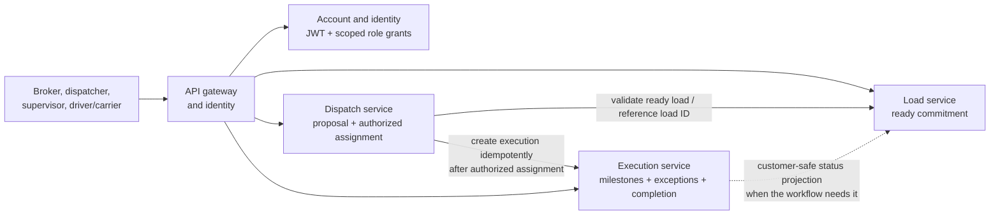

# TMS MVP target architecture

This document describes the target product architecture, not the services
that currently run in the repository. The current implementation is the
shared runtime, API gateway, identity and account-profile foundation, and
local engineering infrastructure; see
[`../ARCHITECTURE.md`](../ARCHITECTURE.md).

## Architecture decisions

- Start the TMS with three domain services: **Load**, **Dispatch**, and
  **Execution**. Do not add further service boundaries without a demonstrated
  ownership, security, scaling, or release need.
- Each service owns its data and business rules. A service must not read or
  write another service's tables directly.
- Identity uses signed JWT access tokens and refresh tokens with
  server-side revocation. An account may carry multiple role grants, each
  with an optional area scope; the company role catalog is defined in
  [`RESPONSIBILITIES.md`](./RESPONSIBILITIES.md). Role grants do not replace
  resource-level authorization for a load, assignment, or execution.
- Keep the reusable backend packages and existing identity/gateway services
  as platform capabilities where their actual contracts fit. The product
  services must own their business rules and communicate through explicit,
  validated contracts.
- Use service APIs for immediate decisions and reads when their latency and
  availability coupling are acceptable. Introduce durable events for
  cross-service facts that need independent delivery or recovery. The
  particular API/event sequence and broker are not selected yet.
- Do not use a distributed transaction. Every cross-service operation must
  have explicit pending/failure behavior, idempotency, and a repair or
  reconciliation path before it is relied on for assignment or completion.

## Service ownership

| Service       | Owns                                                                                                                                        | Does not own                                                                            |
| ------------- | ------------------------------------------------------------------------------------------------------------------------------------------- | --------------------------------------------------------------------------------------- |
| **Load**      | The ready-to-operate transportation commitment, its commercial/customer requirements and revisions, and any customer-safe status projection | Capacity selection, the authorized assignment decision, or the operational event ledger |
| **Dispatch**  | Capacity proposals, assignment authorization, and the authoritative assignment record; identifies the accountable departure-area supervisor | The canonical customer/load requirements or execution milestones and evidence           |
| **Execution** | The movement record after assignment: operational milestones, reported exceptions, evidence, and completion/correction history              | The commercial commitment or authority to decide which capacity is assigned             |

The service boundaries represent separate business authorities, not merely
three folders. Dispatchers may propose and coordinate; only an authorized
supervisor confirms the assignment. Execution records the outcome but does
not grant assignment authority. The departure-area supervisor remains
accountable for operational decisions unless an explicit coverage rule
delegates that authority.

## Main relationship

The diagram shows business ownership and relationships, not a finalized
transport protocol. Existing API-gateway and identity code is being adapted
to TMS roles and authorization. Internal service calls must carry a stable
business identifier and must be validated by the receiving service; a valid
JWT alone does not establish authority over a particular load or execution.

## Source-of-truth rules

- Load owns the commitment and its source requirements. Starting this slice
  does not imply customer booking or brokerage intake.
- Dispatch owns the assignment decision and its authorization history. A
  dispatcher nomination is not an assignment.
- Execution owns operational facts and attached evidence. A customer-safe
  status exposed from Load is a projection, not a second operational source
  of truth.
- Identity owns credentials, token lifecycle, and role grants; it does not
  own load assignment or operating-area accountability records.
- Other services refer to owned records by stable IDs. They do not mutate an
  owner's state by direct database access.
- Preserve revisions and append correction/audit records where the workflow
  needs to correct completed work; do not erase the original operational
  evidence.

## Assignment and cross-service failure

Assignment crosses at least the Dispatch and Execution boundaries, so it
cannot be represented as one atomic database transaction. Before implementing
the call sequence, define the observable state when Dispatch has recorded an
authorized decision but Execution has not yet created its record.

The minimum contract is:

1. Validate that the load is ready and that the actor is authorized to make
   the assignment.
2. Persist the assignment decision in Dispatch with a stable assignment ID.
3. Create or ensure the corresponding Execution using that ID as an
   idempotency key.
4. Report assignment as fully active only when both services agree; otherwise
   expose a clear pending/failed state and a safe retry or reconciliation
   path.

Exact statuses, timeout behavior, and whether the integration uses a direct
API, an outbox/event, or both remain design details to settle with the first
cross-service workflow. Do not return success-shaped responses when the
execution handoff has failed or is unknown.

Execution facts may inform a customer-safe projection in Load. Keep internal
notes, capacity identifiers, and protected evidence out of that projection
unless a future authorized workflow explicitly requires them. Define
visibility and correction rules before exposing the projection externally.

## Reuse and boundaries

- Reuse `@app/common` and `@app/contracts` for stable runtime and transport
  concerns; do not place Load/Dispatch/Execution business policy in shared
  packages.
- The retained auth foundation issues signed JWT access and refresh tokens,
  rotates and revokes refresh sessions server-side, and provisions multiple
  scoped TMS role grants through a trusted operator command. Domain actions
  must still enforce resource-specific authority.
- The gateway currently composes identity and account-profile routes. Add
  explicit Load, Dispatch, and Execution integrations only after their
  contracts and authorization rules are defined.
- The local PostgreSQL server may host separate databases for the three
  services in development, consistent with the current infrastructure
  pattern. A shared server is not shared data ownership.
- Additional queues, workflow engines, caches, and integrations are not
  assumed; use them only when a specific TMS requirement justifies their
  failure modes and operating cost.
- Keep the three product services independently testable. Add service
  deployment and infrastructure machinery only as needed to prove the
  selected end-to-end workflow.

## Decisions to resolve when required

- The exact request and event contracts, event ownership, delivery guarantees,
  ordering, and version compatibility.
- Assignment pending, rejection, cancellation, retry, and reconciliation
  states across Dispatch and Execution.
- The minimum load fields and definition of operational readiness.
- The first capacity type and the authoritative eligibility source.
- Which milestone source is authoritative (manual report, document, device,
  or a later integration), and which evidence is required for completion.
- Actor-specific authorization, supervisor coverage, customer-visible
  status, and correction permissions.
- How scoped role grants connect to product-domain membership, supervisor
  assignment authority, area coverage, and account provisioning.
- Data retention and privacy rules for driver, customer, and freight data.

Resolve a question before the first implementation depends on its answer;
otherwise keep it parked and avoid encoding speculative policy.
