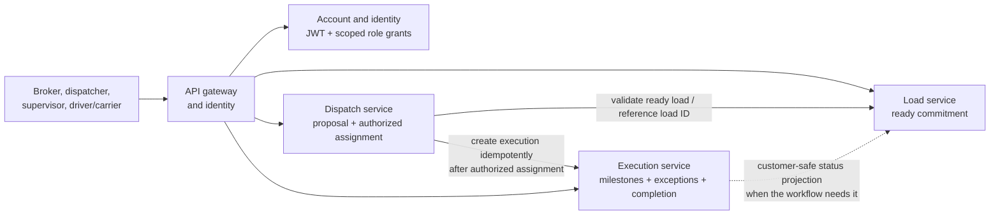

# TMS MVP target architecture

This document describes the target product architecture, not the services
that currently run in the repository. The current implementation is the
shared runtime, API gateway, identity and account-profile foundation, and
local engineering infrastructure; see
[`../ARCHITECTURE.md`](../ARCHITECTURE.md).

## Architecture decisions

- Start the TMS with three domain services: **Load**, **Dispatch**, and
  **Execution**. Do not add further service boundaries without a demonstrated
  ownership, security, scaling, or release need.
- Each service owns its data and business rules. A service must not read or
  write another service's tables directly.
- Dispatch owns editable Reservation records, separate final Assignment
  records, and the active capacity-window claim ledger. Multiple proposals
  may refer to the same capacity without reserving it; a supervisor
  Reservation atomically claims the load and all members of the selected
  capacity configuration. Competing same-load or overlapping capacity-window
  claims produce a conflict. The Reservation records the current Load
  revision and capacity-configuration version, refreshes on changes, and
  retains its revision history for review. Final Assignment links the exact
  Reservation revision and continues the same active capacity claim without
  a gap or duplicate claim. Future work can be reserved while execution is
  in progress only if pickup is no earlier than dispatcher-verified next
  availability and the capacity-use windows do not overlap. Ring 1 keeps
  this ledger in Dispatch; Reservation is a business record, not a separate
  service. This claim ownership does not make Dispatch the source of
  workforce, qualification, maintenance, or legal-eligibility facts.
- Ring 1 uses daily human planning: prior-day loads receive dispatcher
  nomination priority through 4:00 p.m. in the operating area's local time;
  same-day booked loads may be nominated throughout the day. Supervisors
  prioritize prior-day nominations after 4:00 p.m. until workday end. A
  next-morning load booked after the cutoff is directly assigned by the
  supervisor from currently available capacity. Ordinary loads target final
  Assignment no later than the calendar day before pickup; same-booking-day
  pickup follows an emergency path whose detailed rules remain open.
  Dispatchers receive notice and status visibility and can challenge a
  Reservation, but do not approve it. The indivisible unit is one driver,
  one power unit, and its
  optional single trailer; power-only capacity is valid. Separate
  driver/trailer selection, multiple trailers, and routine component swaps
  are deferred. A home-base reconfiguration with driver agreement must be
  recorded as a new configuration before nomination.
  Reservations and Assignments have no time-based expiry. Final Assignment
  creates a distinct decision linked to a Reservation revision; the
  Reservation remains historical while its capacity window stays protected.
  Explicit withdrawal closes a Reservation and its claim only after the
  required safe-release checks. A supervisor may directly assign with
  recorded rationale, bypassing nomination priority and the preferred
  Reservation flow but not eligibility or atomic claims. Direct Assignment
  does not create a Reservation. Assignment/execution history remains
  through completion. At pickup completion, update the occupied capacity
  window using dispatcher-verified next availability so future Reservations
  can be accepted only when they do not overlap.
- Identity uses signed JWT access tokens and refresh tokens with
  server-side revocation. An account may carry multiple role grants, each
  with an optional area scope; the company role catalog is defined in
  [`RESPONSIBILITIES.md`](./RESPONSIBILITIES.md). Role grants do not replace
  resource-level authorization for a load, assignment, or execution.
- Keep the reusable backend packages and existing identity/gateway services
  as platform capabilities where their actual contracts fit. The product
  services must own their business rules and communicate through explicit,
  validated contracts.
- Use service APIs for immediate decisions and reads when their latency and
  availability coupling are acceptable. Introduce durable events for
  cross-service facts that need independent delivery or recovery. The
  particular API/event sequence and broker are not selected yet.
- Do not use a distributed transaction. Every cross-service operation must
  have explicit pending/failure behavior, idempotency, and a repair or
  reconciliation path before it is relied on for assignment or completion.

## Service ownership

| Service       | Owns                                                                                                                                        | Does not own                                                                            |
| ------------- | ------------------------------------------------------------------------------------------------------------------------------------------- | --------------------------------------------------------------------------------------- |
| **Load**      | The ready-to-operate transportation commitment, its commercial/customer requirements and revisions, and any customer-safe status projection | Capacity selection, the authorized assignment decision, or the operational event ledger |
| **Dispatch**  | Capacity proposals, assignment authorization, and the authoritative assignment record; identifies the accountable departure-area supervisor | The canonical customer/load requirements or execution milestones and evidence           |
| **Execution** | The movement record after assignment: operational milestones, reported exceptions, evidence, and completion/correction history              | The commercial commitment or authority to decide which capacity is assigned             |

The service boundaries represent separate business authorities, not merely
three folders. Dispatchers nominate capacity and may report or challenge
readiness; an authorized supervisor controls preassignment and final
assignment. Execution records the outcome but does not grant assignment
authority. The departure-area supervisor remains accountable for operational
decisions unless an explicit coverage rule delegates that authority.

## Main relationship

The diagram shows business ownership and relationships, not a finalized
transport protocol. Existing API-gateway and identity code is being adapted
to TMS roles and authorization. Internal service calls must carry a stable
business identifier and must be validated by the receiving service; a valid
JWT alone does not establish authority over a particular load or execution.

## Source-of-truth rules

- Load owns the commitment and its source requirements. Starting this slice
  does not imply customer booking or brokerage intake.
- Dispatch owns the assignment decision and its authorization history. A
  dispatcher nomination is not an assignment.
- Execution owns operational facts and attached evidence. A customer-safe
  status exposed from Load is a projection, not a second operational source
  of truth.
- Identity owns credentials, token lifecycle, and role grants; it does not
  own load assignment or operating-area accountability records.
- Other services refer to owned records by stable IDs. They do not mutate an
  owner's state by direct database access.
- Preserve revisions and append correction/audit records where the workflow
  needs to correct completed work; do not erase the original operational
  evidence.

## Assignment and cross-service failure

Assignment crosses Load, Dispatch, and Execution boundaries, so it cannot
be represented as one atomic database transaction. The capacity race is at
supervisor preassignment: concurrent requests can attempt to reserve the
same load for different trios or the same trio for different loads. Multiple
candidate nominations are not a conflict and remain non-reserving until a
preassignment or direct assignment commits. Both load uniqueness and
capacity-window exclusion are required.

Dispatch owns the authoritative assignment-claim ledger; this is service/data
ownership, not a claim that the supervisor or dispatcher owns the physical
driver or equipment. The minimum contract is:

1. Serialize Load requirement revisions against Dispatch preassignment,
   direct assignment, and finalization per load. If a broker amendment
   commits first, the previous revision is stale and the supervisor reviews
   the new requirements. If Dispatch commits first, a subsequent change
   follows the preassignment or post-assignment change workflow. Record the
   exact revision and validate actor authority.
2. In one Dispatch transaction, lock/serialize by load ID and all stable
   trio component IDs; enforce one active claim for a load and no overlapping
   claim window for any component. The first valid transaction to commit
   wins. A conflict returns current claim/window for supervisor reassessment;
   do not delay requests for best-match arbitration or silently assign the
   runner-up. Multiple nominations are not claims.
3. Notify the dispatcher and expose the preassignment in its status/list
   view. The persisted reservation is authoritative even if notification
   delivery fails; surface failed delivery for retry/reconciliation.
4. Final assignment transitions the existing claim; do not release and
   reacquire the same capacity. Ensure the corresponding Execution using the
   stable assignment ID as an idempotency key.
5. Report assignment as fully active only when Execution acknowledges;
   otherwise expose a pending state and retain the claim while the result is
   unknown. Retry or reconcile using the same ID.
6. Close a preassignment only on finalization or explicit unpreassignment.
   Keep the execution record active through completion; update the capacity
   window from pickup milestones and verified next availability so
   non-overlapping future work may be planned. Require a structured
   unassignment reason and dispatcher-verified next availability. A
   technical/client timeout is not grounds to release an unknown claim.

For PostgreSQL, implement the Dispatch rule with persisted component-claim
rows, a unique active-load constraint, and an exclusion constraint preventing
overlapping time ranges for the same driver, power unit, or optional trailer.
Lock component IDs in a stable order before inserting all rows in one
transaction. Availability reads are advisory; the database constraint is
the final concurrency guard. Retry serialization/deadlock failures with the
same idempotency key and a bounded policy. A reservation service would not
remove these transactional requirements and would add another cross-service
failure boundary, so defer it unless measured scale or ownership needs later
justify extraction.

The Load/Dispatch revision barrier still needs an explicit implementation
protocol. A candidate is a durable per-load decision gate owned by Load:
preassignment/direct-assignment and load-amendment commands acquire the gate
against an expected revision with a stable operation ID; only one gate may
be pending for that load. Dispatch then commits or rejects its claim in its
own transaction and reports the outcome to close the gate. A broker change
uses the same gate to append a revision and release it. If either call times
out, query/retry by operation ID and retain the pending gate/claim until
reconciliation; do not auto-expire an unknown operation. This is a saga and
must expose a recoverable pending state, not a distributed transaction or
a long database lock held over a network request.

Exact statuses, timeout behavior, and whether the integration uses a direct
API, an outbox/event, or both remain design details to settle with the first
cross-service workflow. Neither preassignment nor confirmed assignment
claims time-expire. The business rule for concurrent Load changes and
Dispatch decisions is commit order wins; the later operation follows the
corresponding preassignment review or post-assignment amendment path. The
remaining design task is to implement a durable Load/Dispatch coordination
barrier that enforces this ordering through retries and partial failure; a
versioned read alone does not resolve the cross-service race. Do not return
success-shaped responses when assignment or execution state is failed or
unknown.

Execution facts may inform a customer-safe projection in Load. Keep internal
notes, capacity identifiers, and protected evidence out of that projection
unless a future authorized workflow explicitly requires them. Define
visibility and correction rules before exposing the projection externally.

## Reuse and boundaries

- Reuse `@app/common` and `@app/contracts` for stable runtime and transport
  concerns; do not place Load/Dispatch/Execution business policy in shared
  packages.
- The retained auth foundation issues signed JWT access and refresh tokens,
  rotates and revokes refresh sessions server-side, and provisions multiple
  scoped TMS role grants through a trusted operator command. Domain actions
  must still enforce resource-specific authority.
- The gateway currently composes identity and account-profile routes. Add
  explicit Load, Dispatch, and Execution integrations only after their
  contracts and authorization rules are defined.
- The local PostgreSQL server may host separate databases for the three
  services in development, consistent with the current infrastructure
  pattern. A shared server is not shared data ownership.
- Additional queues, workflow engines, caches, and integrations are not
  assumed; use them only when a specific TMS requirement justifies their
  failure modes and operating cost.
- Keep the three product services independently testable. Add service
  deployment and infrastructure machinery only as needed to prove the
  selected end-to-end workflow.

## Decisions to resolve when required

- The exact request and event contracts, event ownership, delivery guarantees,
  ordering, and version compatibility.
- Assignment pending, rejection, cancellation, retry, and reconciliation
  states across Dispatch and Execution.
- The minimum load fields and definition of operational readiness.
- The first capacity type and authoritative eligibility source. Dispatch
  owns assignment claims and must serialize competing final assignments.
- The durable Load/Dispatch coordination barrier for concurrent requirement
  changes and final assignment, including compensation and retry behavior.
- Cancellation/no-start claim release, availability reassessment, and
  recovery for a client timeout or partial technical failure.
- Which milestone source is authoritative (manual report, document, device,
  or a later integration), and which evidence is required for completion.
- Actor-specific authorization, supervisor coverage, customer-visible
  status, and correction permissions.
- How scoped role grants connect to product-domain membership, supervisor
  assignment authority, area coverage, and account provisioning.
- Data retention and privacy rules for driver, customer, and freight data.

Resolve a question before the first implementation depends on its answer;
otherwise keep it parked and avoid encoding speculative policy.
