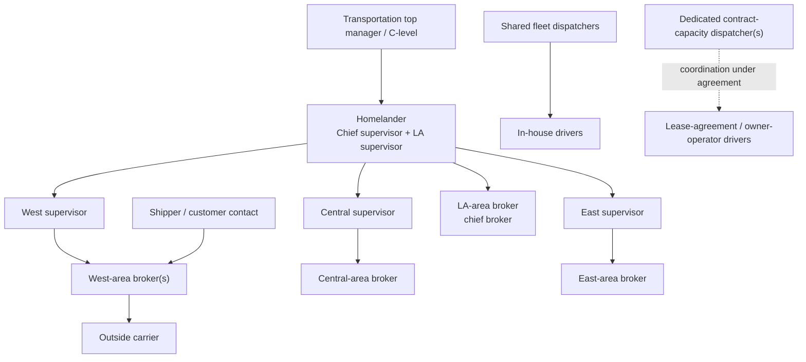
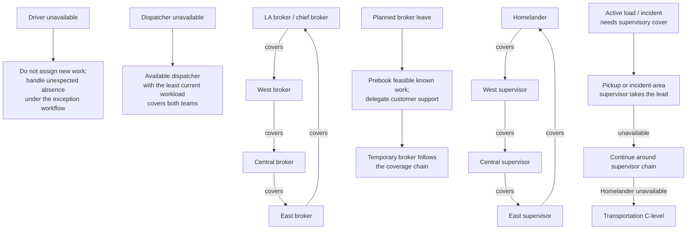

# Actors and authority

## Reporting and coordination

Arrows in the hierarchy show reporting/oversight. The customer and carrier
examples are illustrative. Fleet dispatchers are shared across the
supervisors, not owned by one area. For a specific load, the departure-area
supervisor directs operational decisions. General dispatcher issues go to
Homelander. A local incident-area supervisor coordinates help; they take
operational lead when delegated under the absence rules below.

## Responsibilities

| Actor                              | Owns                                                                                | May do                                                                                                                      | Does not own by default                                             |
| ---------------------------------- | ----------------------------------------------------------------------------------- | --------------------------------------------------------------------------------------------------------------------------- | ------------------------------------------------------------------- |
| Transportation executive / C-level | Department-level escalation and cross-department decisions                          | Receive critical issues through Homelander; set company policy                                                              | Routine load assignment or unrestricted operational data access     |
| Homelander (chief + LA supervisor) | Supervisory coordination; LA-departure accountability                               | Direct area supervisors; handle general issues; make LA-departure decisions; escalate critical matters                      | Every non-LA load's operational accountability                      |
| Area supervisor                    | Operational outcome for loads departing their area; oversight of that area's broker | Confirm/reject assignments; coordinate destination and incident-area support; escalate through Homelander                   | Replacing driver or dispatcher execution duties                     |
| Broker                             | Commercial load quality, capacity sourcing, and customer communication              | Validate instructions; source feasible capacity; communicate verified updates                                               | In-transit truck management or final operational assignment         |
| Fleet dispatcher                   | Day-to-day coordination for assigned in-house driver/truck groups                   | Propose load matches; monitor progress; respond to readiness/status issues; raise load issues to its accountable supervisor | Final assignment approval or changing commercial terms              |
| Contract-capacity dispatcher       | Coordination and status follow-up for lease-agreement/owner-operator capacity only  | Track agreed milestones and exceptions; route company-side decisions to the accountable supervisor                          | Dispatching in-house drivers or managing contractor-owned equipment |
| In-house driver                    | Safe execution and factual reporting                                                | Perform assigned work; take agreed rest; report availability, defects, delays, and exceptions                               | Changing load terms or source records                               |
| Owner-operator / contracted driver | Contracted execution and required updates                                           | Accept/decline work as allowed by agreement; report milestones and exceptions                                               | Being treated as an employee or company-fleet equipment owner       |
| Shipper / customer contact         | Its own freight request and instructions                                            | Submit requests; receive permitted status; request changes                                                                  | Other customers' work or internal allocation decisions              |
| Outside carrier                    | Its accepted transportation work                                                    | Accept/decline tender; report agreed execution milestones                                                                   | Company fleet or unrelated carrier/customer information             |

## Accountability rules

- The departure-area supervisor remains accountable for that load from
  departure planning through operational resolution unless authority is
  explicitly delegated under the absence/incident coverage rules below.
- Homelander is the accountable supervisor for LA departures. Other area
  supervisors retain accountability for their departures and report through
  Homelander.
- The broker owns customer-facing commercial communication; dispatchers and
  supervisors provide verified operational facts.
- In-house fleet dispatchers are shared across supervisors. Load-specific
  issues go to that load's accountable supervisor; general/workforce issues
  go to Homelander.
- Contractor coordination follows the applicable agreement and is not an
  employee reporting relationship. Contractors own their equipment and its
  maintenance.
- Permissions follow organization, assignment, and responsibility—not title
  alone. A person can propose work without being allowed to approve it.

The actual legal entity, contracts, and permitted level of contractor
direction must be validated before this model is used to operate a real
business.

## Absence and continuity coverage

Coverage rules by role:

- **Driver:** planned days off mean no new assignment. An unexpected absence
  is handled according to its cause and the exception workflow; do not treat
  the driver as available merely because their truck is.
- **Dispatcher:** the working dispatcher with capacity covers both teams.
  The covering dispatcher is the one whose drivers are least occupied with
  active work or imminent pickups/deliveries. Schedule at least 7 of 10
  dispatchers to work; this leaves roughly half the team available if two
  additional dispatchers unexpectedly become unavailable. Routine weekly
  days off may be covered remotely. The exact weekday/weekend roster is a
  company scheduling decision, not an assignment-system rule.
- **Broker:** planned leave should be preceded by feasible bookings for the
  known absence period; customer support transfers to the temporary broker.
  Coverage rotates **LA → West → Central → East → LA**, with the LA broker
  as chief broker. When most brokers are unavailable for a prolonged period,
  remaining brokers support existing, booked, and in-progress work and
  accept only loads in their own area. Temporarily suspend the area-presence
  percentage guardrail. Do not continue new bookings under ordinary
  capacity-sourcing assumptions.
- **Area supervisor:** planned leave rotates **Homelander → West → Central
  → East → Homelander**. If multiple supervisors in the chain are away,
  available supervisors absorb additional areas; if only one remains while
  three are away, transportation C-level helps keep operations functioning.
  For an active load, if the absence duration is known and does not extend
  beyond the delivery date, authority is temporary. If the duration is
  unknown or extends beyond delivery, transfer the load's responsibility to
  the cover.
- **Prolonged leadership shortage:** if more than roughly half (about
  50–60%) of brokers or supervisors are unavailable for an unknown or
  extended period, reduce the number and duration of trips until at least
  half return. This is a business continuity policy, not an automatic
  individual load transition.

An absence does not silently remove an active load's accountable owner.
The system records the cover and whether responsibility is temporary or
transferred, based on expected absence duration relative to the load's
delivery date. If business contraction reduces staffing without changing
the driver-to-administrator relationship, the operating rules need not
change solely because headcount fell.
