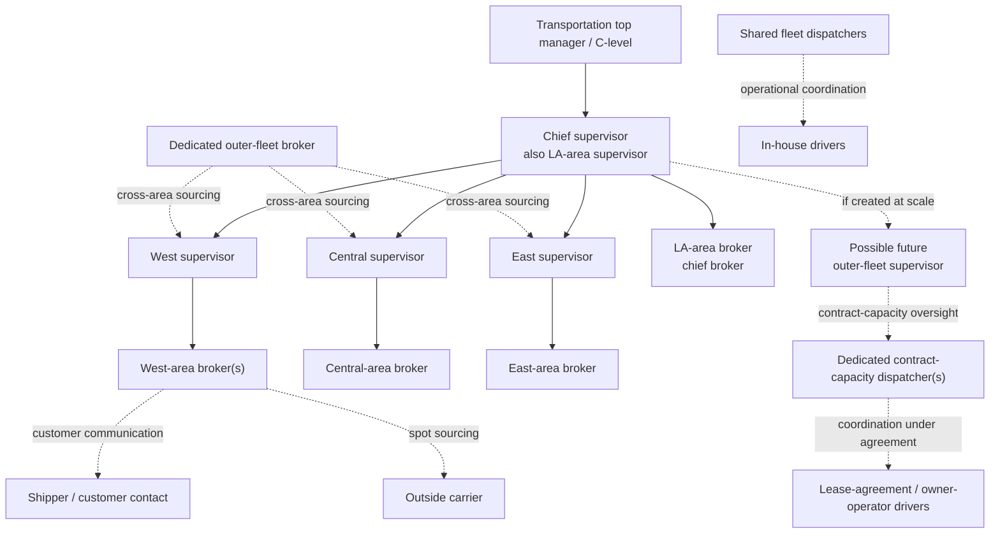
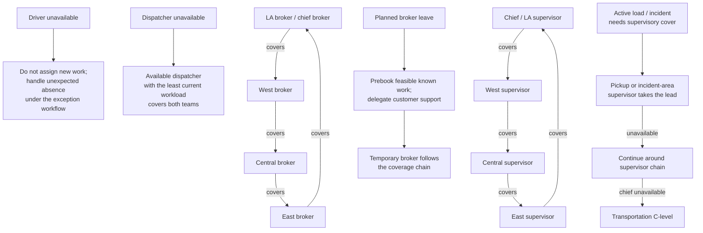

# Company roles and authority

This is the selected role and responsibility model for our TMS study company,
not an org chart every carrier should adopt. The company model is informed by
real-world operations and remains subject to evidence and applicable law.
Roles define authority and responsibilities; they do not imply one account
per job title or that every responsibility is automated.

An account may hold **multiple role grants**, each optionally scoped to an
area. For example, the chief supervisor has company-wide supervisory
coordination authority and a separate `area_supervisor` grant scoped to LA.
The four area keys are `la`, `west`, `central`, and `east`. A role/area grant
is only a coarse authorization input: access to a particular load or
execution must also be checked against its ownership and assignment. A
driver's operating area must not be used as a substitute for checking which
work is assigned to that driver.

## Role grant catalog

| Grant                          | Scope                                    | Core responsibility                                                                           |
| ------------------------------ | ---------------------------------------- | --------------------------------------------------------------------------------------------- |
| `transportation_executive`     | Company-wide                             | Department-level escalation and cross-department decisions                                    |
| `chief_supervisor`             | Company-wide                             | Supervisory coordination and direction of area supervisors                                    |
| `area_supervisor`              | One or more areas                        | Accountable operational outcome and assignment authority for departures from the granted area |
| `broker`                       | One or more areas                        | Load readiness, sole commercial book/decline decision, and verified customer communication    |
| `outer_fleet_broker`           | Company-wide                             | Cross-area managed/spot outer-capacity sourcing when that capability is in scope              |
| `fleet_dispatcher`             | Assigned fleet group(s), optionally area | Day-to-day in-house driver/truck coordination and capacity proposals                          |
| `contract_capacity_dispatcher` | Carrier relationship(s)                  | Coordination and progress follow-up under the applicable agreement                            |
| `in_house_driver`              | Individual driver identity               | Safe execution and factual progress/exception reporting for assigned work                     |
| `contracted_driver`            | Carrier relationship and individual      | Contracted execution and required reporting                                                   |
| `customer_contact`             | Own customer/load relationships only     | Submit instructions and receive explicitly permitted customer status                          |
| `outside_carrier_contact`      | Own carrier/load relationships only      | Accept/tender work and report agreed execution milestones                                     |
| `outer_fleet_supervisor`       | Company-wide                             | Future contract-capacity program oversight if scale justifies the role                        |

The outer-fleet and external-counterparty grants describe later capabilities
in the company model. The first product slice need only enable the roles
required by its selected assignment and execution scenarios. Do not grant
company-wide visibility simply because a role is company-wide in the
reporting chart.

## Reporting and coordination

Solid arrows show illustrative reporting/oversight; dotted arrows show
coordination, not authority. Customers and spot carriers are external
counterparties, not part of the reporting hierarchy. Fleet dispatchers are
shared across the supervisors, not owned by one area. For a specific load,
the departure-area supervisor directs operational decisions. General
dispatcher issues go to the chief supervisor. A local incident-area
supervisor coordinates help and takes operational lead only when delegated
under the coverage rules below.

## Responsibilities

| Actor                              | Owns                                                                                                                                         | May do                                                                                                                                                                                                                                                                               | Does not own by default                                                                         |
| ---------------------------------- | -------------------------------------------------------------------------------------------------------------------------------------------- | ------------------------------------------------------------------------------------------------------------------------------------------------------------------------------------------------------------------------------------------------------------------------------------ | ----------------------------------------------------------------------------------------------- |
| Transportation executive / C-level | Department-level escalation and cross-department decisions                                                                                   | Receive critical issues through the chief supervisor; set company policy                                                                                                                                                                                                             | Routine load assignment or unrestricted operational data access                                 |
| Chief supervisor / LA supervisor   | Supervisory coordination; LA-departure accountability                                                                                        | Direct area supervisors; handle general issues; make LA-departure decisions; escalate critical matters                                                                                                                                                                               | Every non-LA load's operational accountability                                                  |
| Area supervisor                    | Operational outcome for loads departing their area; oversight of that area's broker                                                          | Review nominations; create/update Reservations or directly assign with rationale; finalize a separate Assignment; retain or withdraw a Reservation in response to readiness/requirement changes; coordinate destination and incident-area support; escalate through chief supervisor | Booking or declining customer offers; replacing driver or dispatcher execution duties           |
| Broker                             | Commercial load quality, booking, capacity sourcing, customer communication, and review of potential customer claims                         | Book, clarify, or decline any customer offer regardless of source, without supervisor capacity pre-review; validate instructions; source feasible capacity; set the booked load's managed-carrier offer; review customer-change evidence and contract terms for possible claims      | In-transit truck management or final operational assignment                                     |
| Dedicated outer-fleet broker       | Finding outer-carrier capacity for loads unlikely to receive suitable in-house priority; keeping managed outer capacity productively engaged | Proactively work low-priority/unmatched loads across areas; negotiate with spot carriers by external channels; issue managed-carrier emergency-rate updates; assign only under delegated supervisor authority                                                                        | Changing the in-house-first priority or exposing customer/load revenue without authorization    |
| Fleet dispatcher                   | Day-to-day coordination for assigned in-house driver/truck groups                                                                            | Record stable trio configuration and verified next availability; nominate prior-day loads through 4 p.m. and same-day loads all day; review and challenge Reservation status; report readiness changes; monitor progress; raise load issues to its accountable supervisor            | Approving Reservations or final Assignments; changing commercial terms                          |
| Contract-capacity dispatcher       | Coordination and status follow-up for managed outer-fleet capacity                                                                           | Track agreed milestones and exceptions; rank/propose only loads at the current confirmed offer that the managed carrier is ready to haul; route company-side decisions to its supervisor                                                                                             | Dispatching in-house drivers, final assignment approval, or managing contractor-owned equipment |
| Future outer-fleet supervisor      | Contract-capacity program oversight if the outer fleet grows enough to justify the role                                                      | Coordinate dedicated contract dispatch, carrier readiness, and cross-area capacity practices under company policy                                                                                                                                                                    | Replacing the load's accountable departure-area supervisor                                      |
| In-house driver                    | Safe execution and factual reporting                                                                                                         | Perform assigned work; take agreed rest; report availability, defects, delays, and exceptions                                                                                                                                                                                        | Changing load terms or source records                                                           |
| Owner-operator / contracted driver | Contracted execution and required updates                                                                                                    | Accept/decline work as allowed by agreement; report milestones and exceptions                                                                                                                                                                                                        | Being treated as an employee or company-fleet equipment owner                                   |
| Shipper / customer contact         | Its own freight request and instructions                                                                                                     | Submit requests; receive permitted status; request changes                                                                                                                                                                                                                           | Other customers' work or internal allocation decisions                                          |
| Outside carrier                    | Its accepted transportation work                                                                                                             | Accept/decline tender; report agreed execution milestones                                                                                                                                                                                                                            | Company fleet or unrelated carrier/customer information                                         |

## Accountability rules

- The departure-area supervisor remains accountable for that load from
  departure planning through operational resolution unless authority is
  explicitly delegated under the absence/incident coverage rules below.
- The chief supervisor is accountable for LA departures. Other area
  supervisors retain accountability for their departures and report through
  the chief supervisor.
- The broker owns customer-facing commercial communication; dispatchers and
  supervisors provide verified operational facts.
- The dedicated outer-fleet broker supplements, but does not restrict, other
  brokers' ability to source outside capacity. The role focuses on low-priority
  loads and outer-capacity coverage across areas. Area brokers retain their
  existing customer and sourcing responsibilities.
- No dedicated outer-fleet supervisor is assumed initially. Until that role
  is justified by scale, load accountability stays with the departure-area
  supervisor and contractor coordination stays with the dedicated
  contract-capacity dispatcher.
- In-house fleet dispatchers are shared across supervisors. Load-specific
  issues go to that load's accountable supervisor; general/workforce issues
  go to the chief supervisor.
- Contractor coordination follows the applicable agreement and is not an
  employee reporting relationship. Contractors own their equipment and its
  maintenance.
- Permissions follow organization, assignment, and responsibility—not title
  alone. A person can propose work without being allowed to approve it.

The actual legal entity, contracts, and permitted level of contractor
direction must be validated before this model is used to operate a real
business.

## Absence and continuity coverage

Coverage rules by role:

- **Driver:** planned days off mean no new assignment. An unexpected absence
  is handled according to its cause and the exception workflow; do not treat
  the driver as available merely because their truck is.
- **Dispatcher:** the working dispatcher with capacity covers both teams.
  The covering dispatcher is the one whose drivers are least occupied with
  active work or imminent pickups/deliveries. Schedule at least 7 of 10
  dispatchers to work; this leaves roughly half the team available if two
  additional dispatchers unexpectedly become unavailable. Routine weekly
  days off may be covered remotely. The exact weekday/weekend roster is a
  company scheduling decision, not an assignment-system rule.
- **Broker:** planned leave should be preceded by feasible bookings for the
  known absence period; customer support transfers to the temporary broker.
  Coverage rotates **LA → West → Central → East → LA**, with the LA broker
  as chief broker. When most brokers are unavailable for a prolonged period,
  remaining brokers support existing, booked, and in-progress work and
  accept only loads in their own area. Temporarily suspend the area-presence
  percentage guardrail. Do not continue new bookings under ordinary
  capacity-sourcing assumptions.
- **Area supervisor:** planned leave rotates **Chief/LA → West → Central
  → East → Chief/LA**. If multiple supervisors in the chain are away,
  available supervisors absorb additional areas; if only one remains while
  three are away, transportation C-level helps keep operations functioning.
  For an active load, if the absence duration is known and does not extend
  beyond the delivery date, authority is temporary. If the duration is
  unknown or extends beyond delivery, transfer the load's responsibility to
  the cover.
- **Prolonged leadership shortage:** if more than roughly half (about
  50–60%) of brokers or supervisors are unavailable for an unknown or
  extended period, reduce the number and duration of trips until at least
  half return. This is a business continuity policy, not an automatic
  individual load transition.

An absence does not silently remove an active load's accountable owner.
The system records the cover and whether responsibility is temporary or
transferred, based on expected absence duration relative to the load's
delivery date. If business contraction reduces staffing without changing
the driver-to-supervisor relationship, the operating rules need not
change solely because headcount fell.
