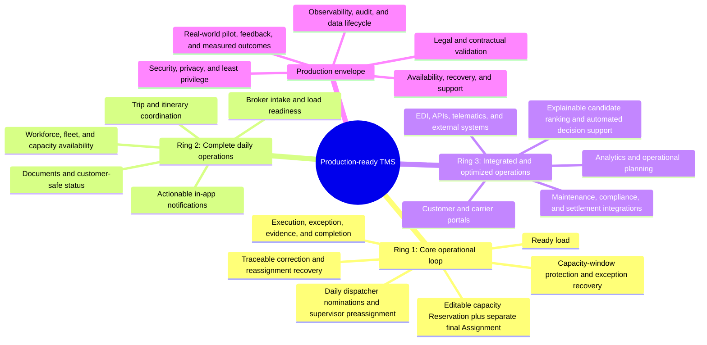
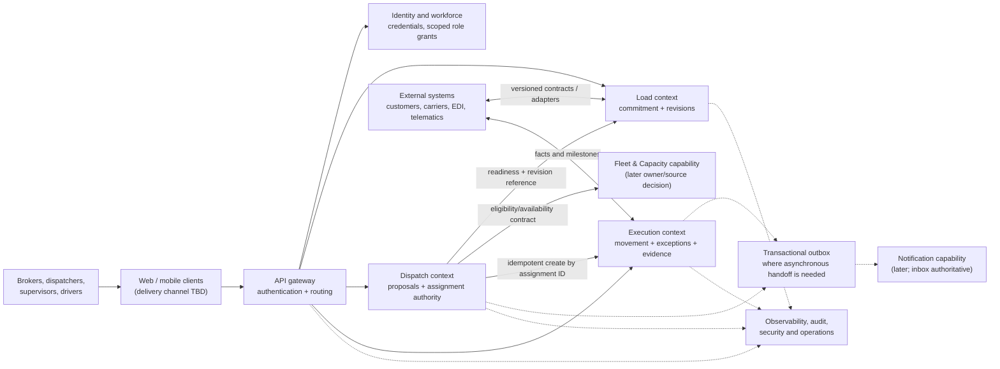

# TMS system vision and capability rings

This document connects the business destination to the technical system we
will build in stages. The company is owner-defined, informed by real trucking
practice, and not customer-validated. The rings are a planning model, not a
promise to implement every capability or deploy every context as a
microservice.

The reference company is a US carrier with its own fleet and brokerage,
initially modeled at 50–100 trucks across LA (home), West, Central, and East.
Keep this size as a design constraint, not a product limit. Treat applicable
law, contracts, and safety obligations as evidence-backed constraints; get
qualified advice before using the system to operate a real business.

## North-star outcome

The TMS should let authorized people coordinate transportation work from
commercial commitment through capacity assignment and physical execution,
with trustworthy customer communication, evidence, recovery from failures,
and a history that can explain who decided what and why.

It is successful as a production candidate only when the business model and
the software have been exercised against real operating conditions with
clear limitations. A feature-complete checklist, a passing local test suite,
or an internally consistent scenario is not proof of customer fit, legal
compliance, or production readiness.

## Capability rings

Each ring adds an evidence-backed capability around the previous one. Build
from the center outward, but let a proven workflow—not the picture—decide
whether a capability is a service, a module, an integration, or unnecessary.

### Center — first operational loop

The first build proves one manual, end-to-end movement. A controlled setup
provides a ready load and a known eligible capacity record; the product then
records an accountable supervisor, a non-reserving proposal, an editable
Reservation that tracks the current Load revision and trio readiness, a
dispatcher challenge path, a separate final Assignment linked to the
Reservation revision, exactly one active execution, progress, an exception
handoff, completion evidence, customer-safe status, and an auditable
correction. If customer changes make assigned capacity infeasible before
movement, terminalize the old execution as `no_start` before safely
releasing its capacity window, then seek an in-house replacement, outside
capacity, or broker-led cancellation. Capture lost availability,
repositioning, and idle time. Once movement begins, use Execution exception
handling instead of immediate requeue.

Load, Dispatch, and Execution are the first product-domain boundaries.
Existing identity, workforce accounts, API gateway, shared runtime, and
local observability support them. Do not turn this slice into a booking
marketplace, an optimization engine, a legal/HOS calculator, a tracking
platform, or an assumed production deployment.

### Ring 2 — operational completeness

Add only capabilities needed to operate beyond a prepared demo fixture:

- Broker intake and controlled load creation, commitment, and revision. The
  broker alone books or declines any customer offer, including an
  outside-broker offer; supervisor approval or capacity review is not a
  prerequisite.
- Authoritative people, driver qualification, equipment, and capacity
  availability data. Initially this may be a small Fleet & Capacity module or
  an adapter to another source; split a separately deployed service only when
  ownership, release, scale, or reliability justifies it.
- Trip planning and multi-load coordination when the operating model needs
  them; never conflate a trip with a load or an execution. Short/long and
  outbound/return-home movements need distinct planning policies over shared
  capacity invariants; exact classifications and advanced multi-load
  scheduling remain later design decisions.
- A durable actionable in-app notification/inbox capability, recipient rules,
  acknowledgement, retry, and escalation. Email/SMS/push are delivery
  adapters, not authoritative business records.
- Document/evidence handling with explicit access, retention, and customer
  visibility rules.
- A customer-safe status projection and the workflows to maintain its
  accuracy.

Before this ring, the first slice must make its prepared data visible as a
boundary and record provenance; it must not imply it can independently
validate qualifications, maintenance, or legal eligibility it does not own.

### Ring 3 — integrated and decision-supported operations

Potential capabilities include customer and carrier access; EDI/API
integrations; telematics and tracking; external compliance, maintenance,
accounting, and settlement systems; analytics; and explainable candidate
recommendations. Each addition needs a named business owner, authoritative
source, data contract, failure/replay behavior, privacy and legal assessment,
and a scenario showing value.

Decision support progresses cautiously:

1. Show feasible candidates and the evidence behind eligibility.
2. Explain rankings and let the accountable supervisor override with a
   recorded reason.
3. Test one-click approval only after concurrency, duplicate actions,
   conflicts, and fairness to stated priorities are covered.
4. Test preassignment at explicit operational milestones.
5. Consider automatic assignment only after measured outcomes demonstrate
   safe company benefit and preserve required human authority.

An event broker, workflow engine, cache, data warehouse, or service split is
not an end in itself. Add it only when a defined delivery, recovery,
throughput, or independent ownership need cannot be met simply and tested
with the existing architecture.

### Outer envelope — production readiness

“Production-ready” is a set of demonstrated operational conditions, not one
final feature ring. Before any real-business pilot, define and verify:

- **Business and legal fitness:** process owners, contracts, carrier/driver
  relationships, applicable federal/state/local rules, safety and HOS
  obligations, insurance, records, and qualified professional review.
- **Security and privacy:** threat model, least privilege and resource-level
  authorization, secrets handling, encryption, account lifecycle, audit
  access, incident response, retention/deletion, and security testing.
- **Reliability:** explicit SLOs and service objectives, dependency budgets,
  overload and degraded modes, idempotency, backups, tested restoration,
  disaster recovery, and reconciliation of asynchronous work.
- **Operational support:** actionable logs/metrics/traces and alerts,
  on-call and escalation ownership, support procedures, training, runbooks,
  rollback, change management, and recovery exercises.
- **Data and integration quality:** source-of-truth ownership, schema
  evolution, duplicate/out-of-order/late updates, reconciliation, monitoring
  of integration health, and clear behavior when partners are unavailable.
- **Real-world validation:** a limited pilot with informed participants,
  safe manual fallback, consent and access boundaries, predefined success and
  stop criteria, captured failures, and a feedback loop that changes the
  model.
- **Measured capacity:** representative load, concurrency, and retention
  profiles; realistic performance tests; and evidence that the chosen
  deployment can meet the agreed objectives at current and expected scale.

Do not claim that completion of the rings proves regulatory compliance or
universal customer fit. Those judgments are specific to the operating
company, contracts, jurisdiction, and reviewed evidence.

## Business architecture

The operating model distinguishes three authorities:

| Business concern                                                   | Accountable owner                                    | System record                                          |
| ------------------------------------------------------------------ | ---------------------------------------------------- | ------------------------------------------------------ |
| What transportation work was committed and what requirements apply | Broker / commercial owner; broker alone books offers | Load and immutable requirement revisions               |
| Which capacity was authorized for that work and by whom            | Dispatch / departure-area supervisor                 | Proposal and assignment decision history               |
| What physically happened, including exceptions and evidence        | Execution / assigned operating participants          | Execution events, evidence references, and corrections |

Identity grants provide a coarse role and area scope. They do not alone
authorize a specific load, assignment, document, or execution. Record-level
relationships and the owning service’s business rules decide access.
Responsibility for a departure, incident coverage, and delegated authority
must be explicit and auditable.

Customer commitment, load, trip, assignment, and execution are distinct
concepts. A customer booking or external tender does not itself assign a
driver or prove capacity availability. A trip can coordinate multiple
executions. Customer-visible status is a deliberately limited projection,
not a second owner of operational facts.

## Technical architecture

The diagram distinguishes business contexts from deployment decisions.
Start with the existing monorepo and independently owned service persistence.
The first inter-service operation may use a bounded API call plus durable
pending state; choose an outbox and delivery worker if required for reliable
eventual handoff. Do not share tables or use a distributed transaction.
Choose message transport only after ordering, delivery, replay, and operating
cost requirements are demonstrated.

### Boundary and contract rules

- Receiving services validate every command at runtime and make decisions
  from their own authoritative state.
- Cross-context messages carry stable IDs, schema/version information,
  occurred/recorded times as applicable, and an idempotency identity.
- Events describe facts already committed by their owner. Commands request
  an action and may be rejected; do not label a command as a fact.
- Store actor, authorization context, source, and rationale where a decision
  or correction needs audit. Do not copy credentials or trust a caller-supplied
  role as proof of record-level authority.
- Persist essential business facts before attempting best-effort notification.
  Delivery failure must not erase an exception or make an assignment appear
  successful when its execution is still pending.
- Use explicit API and event evolution rules. Avoid leaking ORM records,
  authentication tokens, internal evidence, or customer-sensitive fields
  across service boundaries.

## Decision gates before the first implementation

The detailed core workflow and conceptual schemas live in
[CORE_WORKFLOW.md](./CORE_WORKFLOW.md). Before coding, turn its remaining
choices into scenario-specific decisions:

1. Minimum load-ready fields and the revision/optimistic-concurrency rule.
2. First capacity type and the authoritative source for eligibility,
   availability, and temporary reservation.
3. Exact supervisor responsibility and coverage resolution for a departure.
4. Assignment pending/active/failed behavior and safe replay/reconciliation.
5. Minimal execution milestones, exception acknowledgement, and completion
   evidence.
6. Correction permissions and customer-safe projection fields.
7. Minimum UI/inbox behavior to make the workflow usable without silently
   relying on email or an unowned notification service.

Resolve only what the vertical slice needs. Keep other ring decisions
explicitly parked until a business scenario pulls them forward.
