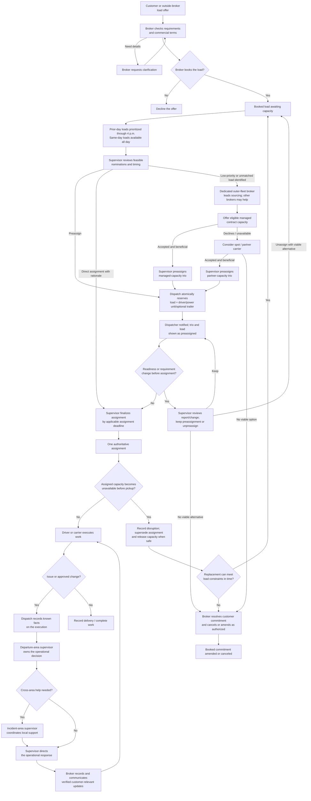
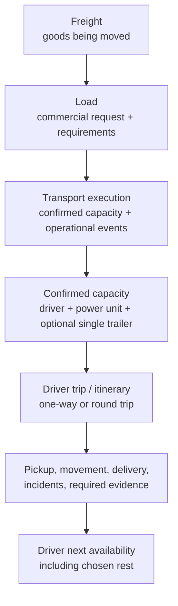
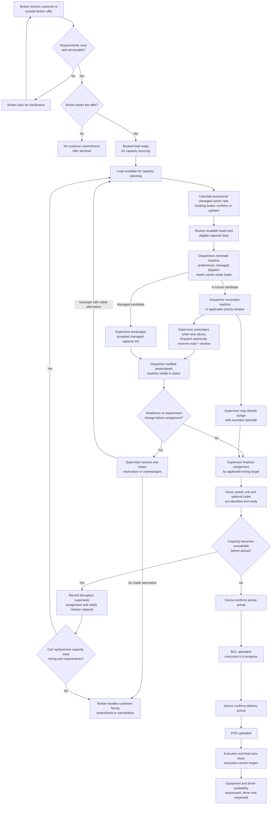

# TMS operating workflow

This document describes the operating model we are designing for our
50–100-truck US company across LA, West, Central, and East. It combines
selected practices from real-world operating models; it is our coherent
company design, not a claim that one carrier or law requires these exact
choices. Verify regulatory and contractual requirements with authoritative
sources before encoding them as rules.

The **first implementation slice** begins with a load ready for operations
and covers authorized assignment, execution, exception handoff, and
completion. The rest of this document defines later capabilities and policy
choices that may be implemented only after the relevant data, authority,
constraints, and tests are defined. This lifecycle describes business
handoffs, not a requirement for one service, database, or event per step.
See the [first-slice charter](./MVP_START.md), [target architecture](./MVP_ARCHITECTURE.md),
the [core workflow and logical schema](./CORE_WORKFLOW.md), the
[capability-ring vision](./SYSTEM_VISION.md), and [company role model](./RESPONSIBILITIES.md).

## The basic path

For every load offer, whether received directly from a customer or through
another broker, the handling broker alone decides whether to book, clarify,
or decline it. That decision does not require a supervisor's capacity
review. Booking creates the commercial load commitment and starts capacity
sourcing; capacity secured and operational assignment remain separate
decisions. Loads booked by the previous day receive nomination priority through 4 p.m.
local time; loads booked the same day may be nominated throughout the day.
Supervisors work the priority queue from 4 p.m. to workday end, while
same-day loads may be reviewed and assigned throughout the supervisor's
workday. A load booked for next-morning pickup after the cutoff is handled
as a direct supervisor assignment from currently available capacity. Ordinary
loads target final assignment no later than the calendar day before pickup;
same-booking-day pickup follows a separate emergency path whose detailed
handling remains to be defined. Preassignment creates a separate, editable
Reservation record and atomically claims the load and the stable driver/power-unit/optional
single-trailer configuration for a capacity-use window, removing it from
competing views for that window. Load and trio changes refresh the
Reservation snapshot and history and may mark it for review. Final
Assignment is a separate decision linked to the exact Reservation revision.
Dispatchers are notified and can inspect or challenge the reserved status,
but no dispatcher approval is required.

For a follow-on load, the current load's BOL must be uploaded and its
execution marked in progress before the trio can be nominated. The
dispatcher records and verifies the trio's next-available date/time; the
next load's pickup cannot be earlier. This supports the next operating
window without committing a trio months ahead. A unit returning from
repair/recovery can be nominated after driver readiness and return-to-service
status are checked. Configuration changes are limited to the home base with
driver agreement and must be recorded before nomination; multiple trailers
and routine component swaps are out of scope.

The supervisor may bypass nomination priority and preassignment and assign
directly when needed. The preferred route is preassignment when time allows,
so the dispatcher can report off-system facts the supervisor may not know.
Direct assignment records the rationale and must still pass the same
eligibility, load-uniqueness, and capacity-window checks.
The supervisor finalizes ordinary loads by the calendar day before pickup.
This is a target, not a claim expiry. A Reservation does not expire or
silently become an Assignment: finalization creates a distinct Assignment
linked to its revision. The execution remains active through delivery, but
at pickup completion Dispatch updates the occupied capacity window using
the dispatcher-verified next availability; future reservations are allowed
only for non-overlapping windows.

### Loads approaching the day-before assignment target

If an ordinary load is still unassigned as the day-before target approaches,
record why and assign an accountable next action rather than treating every
shortfall as the same failure:

- No in-house or managed trio was available or nominated: the dedicated
  outer-fleet broker owns the external-capacity sourcing task and its due
  time. The area broker retains commercial ownership of the booked load.
- Suitable trios existed but were not nominated, or nominations were stale
  against verified availability: the dispatcher and area supervisor review
  the planning failure and next action.
- Viable nominations are waiting for a decision: the departure-area
  supervisor owns the decision backlog.
- Candidate capacity was allocated to loads with stronger company benefit,
  leaving this load without a feasible in-house/managed match: the area
  broker owns sourcing this load externally, with the dedicated outer-fleet
  broker supporting within the remaining time.
- The area booked beyond known or reasonably forecast capacity: the area
  broker must flag the overage to the dedicated outer-fleet broker and
  participate in finding outside capacity, rather than treating managed
  capacity already counted in the plan as new supply.

These are operational accountability categories, not automatic disciplinary
scores. Capture nomination timing, stated availability, decision/outcome,
reason, and assigned follow-up owner. A future participation score should
distinguish missed or stale dispatcher action from no suitable capacity,
supervisor backlog, or brokerage overbooking; exact scoring remains out of
scope until these records can be tested.

The proposed dispatcher participation signal may account for how many
reasonable load/direction options were nominated, whether any were selected,
and whether the dispatcher nominated the best remaining feasible alternatives
when preferred work was unavailable. Preserve the owner's intent that fewer
useful nominations or repeated non-selection may lower the signal, but do
not reward infeasible or duplicate spam. Record why a nomination was not
selected (for example, a supervisor chose stronger company benefit or a
competing trio/load won) so the eventual score can distinguish dispatcher
participation from supervisor and company-capacity outcomes. It is not a
Ring 1 automated ranking formula.

If assigned capacity becomes unavailable before movement starts, preserve and
supersede the prior assignment rather than silently reusing it. Return the
booked load to capacity sourcing only after the prior assignment is terminal
as no-start and its claim is closed. Reassign when another option can meet
the load's timing and requirements; otherwise the broker handles the
customer-facing amendment or cancellation under the applicable agreement.
Closing a claim does not by itself establish driver rest, equipment
serviceability, or general availability. Once movement has begun, handle
capacity failure as an execution exception rather than automatically putting
the load back in the pre-execution queue.

The assignment policy is intentionally human-authorized. Drivers can state
their preferences and readiness; dispatchers contribute operational
knowledge and propose/rank feasible candidates; the departure-area
supervisor weighs those inputs against the company's benefit for the
specific load and makes the decision. The company-benefit criteria are not a
single global score: define the relevant priorities and constraints for the
load before automating a recommendation.

The automation progression is a later design path, not part of the first
slice:

1. Capture explicit capacity, driver, dispatcher, and company-priority data.
2. Validate eligibility and assignment invariants; show feasible candidates
   and the reasons they rank as they do.
3. Let the supervisor choose among nominations and record a rationale.
   Preassignment must atomically stop the load and trio from appearing as
   available for competing work.
4. Evaluate one-click approval and automated matching against operational
   scenarios and measured outcomes. Daily human preassignment is already
   part of Ring 1.
5. Consider automatic assignment only after objectives, constraints,
   employee-priority treatment, overrides, and safeguards are explicit and
   tested. An automated recommendation must not silently become authority.

## Core work concepts

Keep these concepts separate:

- **Freight** is the physical goods being transported. A load describes the
  requested movement of that freight; it is not the freight itself.
- **Load** holds the customer/source, pickup and delivery locations,
  appointments and timing, freight/commodity and equipment requirements,
  relevant contact, and commercial instructions. Preserve its revisions from
  booking through delivery.
- **Transport execution** records how the load is carried out: confirmed
  capacity, progress, operational changes, incidents, and delivery evidence.
  Changes to customer requirements are preserved as load revisions;
  execution events link to the relevant revision without replacing the
  load's requirements. Post-delivery questions or feedback belong on the load
  record, not the closed execution.
- **Role-specific information:** brokers work from the load record;
  dispatchers and drivers work from the execution; supervisors can see both.
  Only customer-safe status and operational summaries needed for service are
  copied from execution to the load. These may include status, current
  location, on-time state, and an incident's customer-relevant reason and
  resolution. Equipment identifiers, paperwork, technical details, and
  internal notes remain in the execution.
- **Trip/itinerary** describes a driver's planned sequence of movement and
  can be linked to one or more load executions. A one-way/round-trip label
  describes direction/return plan; short/mid/long describes distance or
  duration. These are independent classifications.
- **Capacity assignment** links a driver to a power unit and one or more
  compatible trailers for an execution. A truck's location alone does not
  establish driver availability.

Do not merge multiple customer loads merely because a driver performs them
as a short round-trip or a customer pays for them as one round-trip package.
An extra-short round-trip may have special commercial treatment while
remaining distinct from a long round-trip. The proposed accountability rule
is that the supervisor for the first pickup area owns an extra-short
round-trip, even if another pickup occurs on the return and the vehicle
enters another area. Validate exact boundaries and commercial treatment
later.

The handling broker alone decides whether to book, clarify, or decline every
customer load offer, including offers received through an outside broker.
This commercial decision does not require supervisor approval or a capacity
review. Booking establishes the customer
commitment and starts capacity sourcing; it does not itself secure capacity
or create an operational assignment. Supervisors decide how to assign
capacity to a booked load, not whether to accept its offer.

When a load is booked, the system calculates a managed-carrier offer from the
booked customer rate using a contract-approved percentage within that
carrier's configured range. The booking broker confirms or updates the
optimal offer on the load record. This confirmed rate is shown to the
dedicated contract-capacity dispatcher in managed-carrier ranking and is the
rate the managed carrier accepts by having its dispatcher rank the load.
Other dispatchers do not see the managed-carrier offer. Do not expose the
customer's rate or negotiate the managed offer as an ordinary spot bid.

For an eligible managed carrier that does not prefer a load, the broker and
accountable supervisor may authorize an emergency rate increase within the
carrier's agreement. Record the emergency flag and revised offer on the
load, then return it to the managed-carrier candidate pool as a
new/modified opportunity. The carrier's dispatcher must be able to review
and rank that updated offer before it can be assigned. Do not silently
change the rate after the carrier has ranked the previous offer.

## Successful transportation path

The successful case means a broker books work the company intends to service;
every active load has one accountable supervisor and one authoritative
capacity configuration, reserved for its capacity-use window; required
pickup and delivery records are captured; and
the driver is not assumed available again until their schedule, chosen rest,
and equipment status support it. Customer feedback is not a condition of
completion.

Prior-day loads receive nomination priority until 4 p.m. local time;
same-day loads can be nominated throughout the day. A follow-on nomination
requires the current load's BOL and in-progress status plus a
dispatcher-verified next-available time. The next load's pickup cannot be
earlier than that time. Reservation creates an editable planning record and
an exclusive claim for the load and stable capacity configuration over its
use window; load and trio changes refresh its snapshot and history and may
require review. The dispatcher is notified and can inspect or challenge the
Reservation but does not approve it. Final Assignment is a distinct decision
record linked to the exact Reservation revision. The supervisor may bypass
priority and Reservation to assign directly, with rationale. A dispatcher
may report changed readiness, and the supervisor may retain or close the
Reservation. Every closure needs a structured reason and dispatcher-verified
component status/next availability. If the trio's condition is unknown, do
not treat claim closure as availability. The execution record continues
through delivery, while verified availability updates the capacity-use
window for future non-overlapping work.

A delay or new driver/equipment issue can move the verified next-available
time past a future reservation's planned pickup. Treat that as a schedule
conflict, not as permission to move either load silently: notify the
dispatcher and accountable supervisor, reassess the affected windows in
pickup-time order, and explicitly unassign or operationally resolve work
before changing claims. Once a future load is finally assigned, use its
normal exception/reassignment path.

Customer requirement changes during Reservation notify both supervisor and
dispatcher, refresh the recorded revision, and trigger a fit/review
assessment. The supervisor may retain or close the Reservation with a
reasoned decision. After final Assignment, reassess the trio against revised
requirements and remaining time. If it no longer fits before movement,
confirm `no_start` before safely releasing it, seek a replacement, then
outside capacity, and finally broker-led cancellation/amendment if needed.
Record the original trio's readiness, release and next-available times,
repositioning/deadhead, idle time, and execution milestone. If movement has
begun, handle the change as an Execution exception and do not treat the trio
as immediately available. The broker reviews evidence and contract terms
for possible customer claims; the system does not infer legal entitlement or
automatically charge. The driver is notified but does not accept or confirm
the load in the system.

For a load picked up in LA that is expected to return toward home, begin
ranking and nominating feasible return-home loads as soon as the pickup BOL
is uploaded and execution is in progress, even while the outbound load is
still moving. The next pickup must respect the dispatcher's verified
next-available time. This is especially important before a driver reaches
the prior destination. Planning/Reservation is not a requirement that the
driver continue working: protected rest remains the driver's choice and
must be respected.

The load and execution close automatically when the POD is received. The
execution is immutable after closure and cannot be reopened. The closed load
may still receive later customer questions, comments, or corrections; these
are appended to its record without reopening the execution. For changes
before completion, update the existing load and, when affected, its
transportation record. Preserve a change block identifying changed fields
and the prior values; do not cancel and recreate work merely to represent an
authorized change, or trigger automatic reassignment cascades.

## Load readiness and operational record

Before the load enters capacity confirmation, the broker checks that the
customer's instructions are clear enough to transport safely and meet the
commitment. The exact field checklist is determined by freight, route,
equipment, and applicable requirements; research will define it rather than
assuming one universal form. The readiness check must establish that:

- Required legal rules and customer requirements are met for the particular
  freight and movement; inapplicable requirements are not imposed.
- Freight, truck, and trailer suitability and safety have been checked.
- The driver is healthy, legally eligible, and qualified for any special
  freight or handling requirement.
- Pickup and delivery locations, facilities, appointments, and time
  commitments are specified. Preserve exact customer-mandated choices;
  where alternatives are allowed, the broker can select a feasible
  location/window against capacity and secure appointments.
- Customer contacts, operating instructions, access constraints, and other
  details needed to perform the movement are available.

Missing or ambiguous requirements return to the customer for clarification
before capacity is committed. The matching process applies the researched
requirements relevant to that load and excludes non-applicable checks.
Preserve customer requirements separately from appointment choices and
later revisions.

The execution log records operational facts and evidence:

- At pickup and delivery, record arrival, service start, and service end
  times where applicable. Attach the bill of lading (BOL) at pickup and the
  proof of delivery (POD) at delivery.
- Device location, not a driver's self-reported arrival claim, establishes
  arrival at pickup or delivery. Until the device indicates arrival at the
  location, do not change the execution to pickup or delivery status.
- On BOL/POD upload, record the paperwork's pickup/delivery start time as
  the corresponding arrival/start time. Compare that time with the
  device-established arrival: a small discrepancy can prompt a device check;
  a large discrepancy is investigated with dispatch and the relevant
  facility when needed. The acceptable interval is still to be defined.
- A significant delay or discrepancy must be reported by the driver to
  dispatch, even if the facility continues to load or unload. Dispatch keeps
  the customer informed through the broker. Communication is relevant
  context in review; no automatic driver score or disciplinary outcome is
  defined here.
- Device-confirmed pickup arrival changes status to **Pickup**; BOL receipt
  changes it to **In progress**. Device-confirmed delivery arrival changes
  status to **Delivery**; POD receipt changes it to **Finished/Completed**
  and automatically closes both the load and execution.
- Record loading/unloading service start and end times to distinguish wait
  time from service duration.
- A customer may be granted access to permitted log-book events when the
  company chooses to expose them; internal operational notes are not
  automatically customer-visible.
- These timestamps preserve actual dwell and transit duration and support
  later review of delay or detention claims; they do not by themselves
  determine fault or entitlement.
- Dispatch monitors the driver log and obtains a progress update about once
  or twice daily, unless reliable automation supplies it. Automation is a
  later implementation choice.

If an incident is reported, the driver contacts dispatch and dispatch
records the known facts on the execution. Notify the accountable
departure-area supervisor and the supervisor for the incident area when
different; the broker copies only customer-relevant status, reason, and
resolution to the load and communicates verified updates. If a required
supervisor acknowledgement is not received within the agreed interval,
dispatch follows up directly. The interval and incident-specific response
procedure remain to be defined.

## Driver and equipment availability

Availability has two distinct parts:

- **Technical eligibility:** equipment is serviceable and the driver is
  legally and operationally eligible to begin the next assignment, including
  required rest and available driving hours. Reassess after delivery.
- **Driver-reported readiness:** the driver states before assignment how
  much of their guaranteed rest they plan to take and reports any additional
  need that affects readiness. The dispatcher uses this information when
  ranking loads. A load must not be confirmed on the assumption that the
  driver will forgo protected rest.
- **Scheduled time off:** do not assign new loads to a driver on a known day
  off. An unexpected absence removes the driver from new capacity planning
  and follows the applicable exception process.

These checks happen at different times: declared readiness informs daily
dispatcher nominations; the supervisor reviews the latest known capacity
state when preassigning and finalizing; technical eligibility is checked
again after the prior delivery. If a driver's health or readiness changes
unexpectedly, dispatch records the change and the supervisor coordinates
operational replanning. For a load not yet in execution, return it to
sourcing when a replacement can meet its constraints; otherwise the broker
handles any customer-facing commitment change or cancellation. Changes
after movement begins follow the execution exception workflow.
The dispatcher team covers a dispatcher who is off; no load assignment
depends on an off-duty dispatcher being available.

## Contract capacity in the successful path

Contract drivers and their dedicated dispatchers follow the same operational
milestones as in-house capacity where the agreement supports it: assignment,
notification, pickup, progress, incidents, delivery, and POD. Contract
capacity remains lower priority when sourcing a load, but once committed,
the company tracks the execution and customer communication through
completion. Contract rates are required when comparing their capacity.
Responsibility for vehicle/driver costs or cargo loss is governed by the
applicable agreement and is outside this workflow.

Keep two outer-capacity paths distinct:

- **Spot outside carrier:** until the carrier is brought into the company's
  managed outer-fleet pool, brokers handle it as an ordinary external
  carrier: source capacity, negotiate, and confirm the spot offer through
  the normal external-carrier process.
- **Managed outer-fleet carrier:** once a carrier has accepted and picked up
  a company load tracked in the system, its known truck and availability may
  be considered for future loads. The carrier remains contract capacity, not
  in-house fleet.

Future matching assistance may identify and rank feasible load matches for
in-house drivers/trucks and managed carriers. It is not part of the Ring 1
manual nomination flow. When introduced, dispatchers should be able to
review or rerank suggestions using relevant driver/team knowledge; managed
dispatchers must exclude any load the carrier is not ready to haul at its
confirmed offer. The agreement determines each carrier's permitted
percentage range. A later rate algorithm may use evidence and analytics;
until then, a configured default must be confirmed by the booking broker.
Any managed-carrier offer that is treated as acceptance of a settled rate
must state that condition explicitly before ranking or supervisor selection.
The departure-area supervisor retains authority to choose among feasible
in-house and managed candidates based on company benefit. Availability,
qualification, equipment fit, contractual readiness, and customer timing
remain hard constraints. Record the supervisor's decision, rationale, and
relevant load/assignment revision.

Managed capacity follows the same Reservation boundary: once accepted as a
candidate, the supervisor creates a Reservation and Dispatch atomically
claims the load and trio window. Its dispatcher is notified and may report
changed readiness, but does not approve the Reservation. The
departure-area supervisor retains final Assignment authority; after a
managed carrier is finally
assigned, do not swap the carrier or load as ordinary optimization. A
genuine readiness change is an exception: record it, safely unassign/release
the old claim, and re-source the still-booked load when a replacement can
meet its constraints. If movement has begun, use the execution exception
workflow rather than automatically
re-queueing it. If a carrier completes delivery without a confirmed next
assignment, its dispatcher must return it to the candidate pool before normal
ranking resumes; a supervisor may still make a reasoned manual selection
under the override rule above.

## Dedicated outer-fleet sourcing

The dedicated outer-fleet broker works proactively from the capacity-planning
stage, identifying loads likely to remain unassigned or low priority for
in-house capacity and sourcing managed contractors or spot carriers for
them. The role also seeks suitable outer capacity in areas where the company
has little or no in-house presence, avoiding unnecessary competition with
the in-house fleet. This does not reserve low-priority loads exclusively to
that broker; other brokers may still source outside capacity.

Do not assume outside carriers have accounts or sign in to the platform.
For spot capacity, the dedicated broker may notify listed carriers through
email or another external channel:

- For a usual load, open at the lowest rate the company is prepared to offer
  and negotiate up to the broker-authorized optimal rate.
- For an emergency load, open at the optimal rate and negotiate up to the
  full customer rate when authorized.
- The carrier may reply with a bid or contact the broker directly. The broker
  conducts and records the negotiation; whether a deal is reached depends on
  the negotiation, not an automated bidding workflow.

For managed capacity, offer the confirmed optimal rate immediately rather
than starting at the low end of a negotiation. If company policy allows an
emergency increase for a suitable but unpreferred load, the broker and
supervisor authorize and record it; the updated offer returns to the managed
dispatcher for explicit ranking.

There is no dedicated outer-fleet supervisor initially. The dedicated
outer-fleet broker may make assignments under supervisor-delegated authority
until that role is staffed. The departure-area supervisor remains
accountable unless responsibility is explicitly transferred. If outer
capacity grows enough to justify a dedicated supervisor, that role may
oversee the contract-capacity program and dispatch coordination without
taking over individual load accountability by default. Contractor crashes
and other service failures remain part of the later exception workflow.

## Customer rate and load changes

Treat the booked customer rate as fixed under the accepted customer
agreement; a customer rate reduction is not assumed valid without the
company's agreement. The actual contract and applicable rules govern and
must be validated. If the customer rate increases, the company decides
whether any additional compensation is due to a managed carrier; do not
automatically pass through an increase.

If the customer requests a rate, freight, or load-requirement change after
booking, and that change is legally permitted and approved, update the
existing load and its transportation record where the change affects
execution. Record a change block identifying the changed fields; do not
create a replacement load and cancel the old one merely to record the change.
Handle the operational impact as a fleet-wide change, not a contractor-only
workflow. A rate increase does not automatically alter carrier compensation.
The changed-fields block also gives future analytics a direct marker for
loads that were revised without scanning every unchanged load.
For a change to load requirements after capacity has been assigned:

1. The broker records the requested customer change and confirms what the
   customer is authorized to change under the agreement.
2. Notify the assigned dispatcher and driver, or the managed carrier's
   dispatcher and carrier, plus the accountable supervisor. Record the
   carrier's response when managed capacity is involved.
3. Recheck safety, legality, equipment/driver suitability, timing, and
   economics for the current assignment and any replacement capacity.
4. The carrier's willingness to accept the change is input, not the
   company's approval. The supervisor and broker decide whether to keep the
   assignment under agreed terms, reassign capacity, or cancel/decline the
   changed work according to customer and carrier agreements.
5. Record the approved change and its changed fields on the existing load and
   affected execution; notify affected parties. Do not silently change the
   accepted carrier rate, load scope, or assignment.

Until a common change-handling workflow is implemented for all capacity
types, these decisions are manual. Customer-rate or requirement changes do
not automatically recalculate accepted carrier compensation or trigger
automatic reassignment/cancellation. Preserve the original values, the
approved changed fields, decisions, and change history. Future change
handling must accommodate legally permitted changes from any source and
distinguish changes to the load, freight, execution, and company commitment;
define that general workflow before automation.

## Matching by trip direction

Keep homebound and outbound capacity matching distinct:

- **Homebound loads:** emphasize operational fit—driver/truck eligibility,
  location, timing, equipment, and progress toward home. Drivers broadly
  share the homebound objective, so matching is primarily a technical and
  company-positioning problem.
- **Outbound loads:** apply the same feasibility checks, then account for
  drivers' preferred destinations and routes. This is a preference-allocation
  problem: preferred destinations may be oversubscribed, and not every
  driver's preference can be met on each trip.

Treat outbound preferences as soft requests, not promises. When similarly
suitable drivers compete for a limited set of preferred destinations, balance
who receives preferred assignments over time, giving consideration to drivers
who have gone longer without a preferred placement. The supervisor still
weighs company benefit and area coverage, and must not override feasibility,
customer commitments, or driver readiness to satisfy this balancing goal.
The system should make prior preferred assignments visible as operational
context, not as a performance score. The lookback period and exact tie-break
rule remain to be defined.

## Daily preassignment stages

Every day, dispatchers may nominate loads for each available driver/truck/
trailer trio. A trio becomes eligible for nomination when its prior
pickup/movement cycle makes it available or when it returns to service after
repair/recovery. Nominations are open until 4:00 p.m. in the applicable
operating area's local time. A dispatcher may state priorities and nominate
the same trio for multiple loads; multiple trios may also be proposed for the
same load. These preferences do not reserve either side.

From 4:00 p.m. until the supervisor's workday ends, the departure-area
supervisor reviews nominations against hard eligibility, load requirements,
timing, driver/dispatcher preferences, and the company's benefit for each
load. The supervisor may create a Reservation for one load and one trio. The
Reservation must atomically exclude that load from other trios and every
member of the trio from overlapping capacity windows. Final Assignment is a
separate record linked to the exact Reservation revision and maintains the
same active claim; it does not claim capacity a second time. The dispatcher
receives an in-app notification and can inspect or challenge the
Reservation, but does not approve it. No automated ranking, fixed number of
nominations, or award priority order is established for this first slice.

If a capacity or customer-requirement change makes the reserved trio
infeasible or no longer beneficial, notify the supervisor and dispatcher.
The supervisor decides whether to keep the preassignment or explicitly
unassign it. Unassignment closes the claim and sets the trio's actual
operational status; the booked load returns to the available stack when
another trio can meet its requirements and timing, otherwise the broker
handles the customer commitment. Preassignment has no time-based expiry or
preference lock cutoff. Safety, qualification, and hours-of-service rules
remain hard constraints throughout.

## Availability and capacity priority

- In-house availability is about the **driver**, not merely a truck's
  location. Drivers need their agreed rest time and may take it where they
  are. An idle or nearby truck does not make its driver available.
- Treat driver schedule/rest, legal eligibility, and truck condition as
  separate facts. A truck defect may make a driver/truck pairing unsuitable,
  but does not automatically impose a fixed or fractional availability
  penalty. The detailed effect of an issue on future availability remains
  undefined.
- When sourcing capacity for a load, the proposed acquisition order remains:
  suitable in-house capacity, then lease-agreement/owner-operator capacity,
  then partner carrier, when that order benefits the company and meets the
  commitment.
- Company benefit includes suitable coverage and strategic presence beyond
  the strongest local market, not just immediate rate or trip length. Do not
  force a priority order if it breaks timing, customer requirements,
  agreements, or sensible economics. If no option works, decline or cancel
  under the applicable terms.
- For company-owned fleet distribution, use a provisional target of at least
  10% and no more than 50% of the fleet in each non-home area. The LA home area
  is exempt from the upper bound because trucks return there. Whether
  presence is measured by truck count, and over what time window, remains
  open; the percentages are a planning guardrail, not a forecast.
- Apply hard constraints before preferences: safety/legal eligibility,
  driver-guaranteed rest, load/equipment compatibility, and customer
  commitments define what is feasible. Among feasible choices, the supervisor
  balances company benefit and area/homeward positioning with dispatcher
  nominations and driver trip preferences. Automated match rankings may
  later support this decision, but are not required for Ring 1.
  Preferences help choose; they do not override a hard constraint or make an
  unconfirmed proposal binding.
- For in-house drivers, dispatcher nominations capture relevant driver/team
  knowledge and priority. The dispatcher does not confirm a supervisor's
  preassignment. For managed carriers, use the same nomination/preassignment
  process
  but rank only loads their dedicated dispatcher has marked acceptable for
  that carrier/truck. The pickup-area supervisor makes the final assignment
  across both candidate groups, preferring in-house capacity only when its
  match is close in company benefit; a clearly superior managed-carrier match
  may be assigned when it benefits the company.
- If multiple in-house trios remain equally strong after feasibility,
  company/area priorities, and dispatcher nominations are considered, the
  supervisor chooses among them. Any tie-breaking policy remains to be
  defined and must not bypass established priorities.
- If a contractor declines, release the reservation and return the load to
  sourcing. After delivery, a contractor may not be nominated for a reload
  until the broker selects it from the unassigned pool.
- Exact assignment, reassignment, and cancellation windows come from the
  applicable customer instructions, appointment, and agreement; there is no
  universal cutoff in this model.

## Regional working assumptions

- **West:** faster turnover; make primary assignment decisions quickly and
  allow less discretionary reassignment. Do not spend effort sourcing
  contractors/partners when beneficial in-house capacity is available.
- **East:** fewer daily loads and longer journeys allow more deliberate
  decisions and closer attention to contractor/partner options. Up to two
  assignment rounds (initial choice plus one reconsideration) may be allowed
  only when deadlines leave time.
- **Central and LA:** their distinct decision cadences remain to be defined.
- **West broker split (proposed):** one broker focuses mainly on outgoing
  loads; the other mainly brings trucks toward LA and also handles outgoing
  loads. The return-focused broker activates incoming sourcing when about
  two-thirds of the fleet is outside the LA home area, starting with
  West and continuing until outward deployment can resume. The denominator,
  home-area boundary, and stop condition remain to be defined.
- Geographic presence may justify a suitable lower-rate load when it
  maintains service outside the strongest market.

## One-time versus dedicated work

A one-time load is a single customer movement. A dedicated program is a
recurring lane, schedule, or capacity commitment that produces individual
loads. Each execution still needs an accountable assignment and handoffs.
For dedicated work, assign the program to a dispatcher who already manages
spot drivers when feasible; route each successive load to that dispatcher
and use their available dedicated drivers first. If none can cover a load,
the dispatcher may add a driver or change the dedicated group. A dispatch
team may grow to about 15 drivers, including dedicated drivers. If the
dedicated contract ends, its drivers return to spot work without changing
dispatchers. The dispatcher is dedicated to the work only if staffing
requires it; the program does not automatically require a separate
dispatcher or exclusive trucks.
