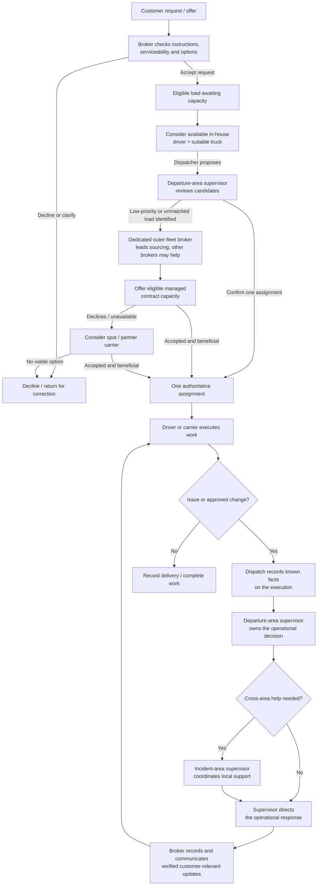
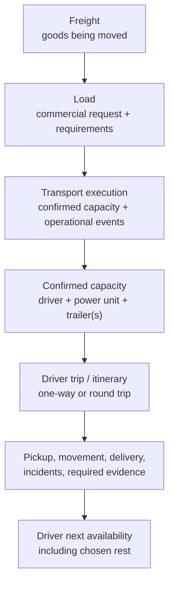
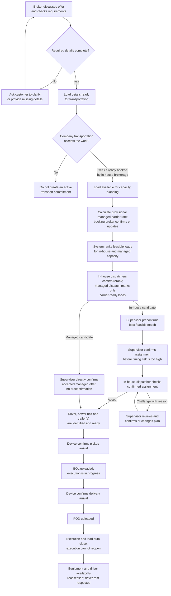

# Reference load workflow

This document records a possible operating model, not required software
behavior. The detailed sourcing, rate, matching, award, regional, and absence
rules below are hypotheses for the example company; they must not be treated
as a commitment to implement a full TMS. The lifecycle describes business
handoffs, not a requirement for one service, database, or event per step.

## The basic path

Customer acceptance, capacity secured, and operational assignment are
different decisions. Accepting a request does not imply capacity is secured.
A dispatcher nomination does not reserve a load or truck; supervisor
confirmation creates one authoritative assignment and closes competing
nominations. If no dispatcher proposes eligible in-house capacity, the
supervisor may assign or request a proposal.

## Core work concepts

Keep these concepts separate:

- **Freight** is the physical goods being transported. A load describes the
  requested movement of that freight; it is not the freight itself.
- **Load** holds the customer/source, pickup and delivery locations,
  appointments and timing, freight/commodity and equipment requirements,
  relevant contact, and commercial instructions. Preserve its revisions from
  booking through delivery.
- **Transport execution** records how the load is carried out: confirmed
  capacity, progress, operational changes, incidents, and delivery evidence.
  Changes to customer requirements are preserved as load revisions;
  execution events link to the relevant revision without replacing the
  load's requirements. Post-delivery questions or feedback belong on the load
  record, not the closed execution.
- **Role-specific information:** brokers work from the load record;
  dispatchers and drivers work from the execution; supervisors can see both.
  Only customer-safe status and operational summaries needed for service are
  copied from execution to the load. These may include status, current
  location, on-time state, and an incident's customer-relevant reason and
  resolution. Equipment identifiers, paperwork, technical details, and
  internal notes remain in the execution.
- **Trip/itinerary** describes a driver's planned sequence of movement and
  can be linked to one or more load executions. A one-way/round-trip label
  describes direction/return plan; short/mid/long describes distance or
  duration. These are independent classifications.
- **Capacity assignment** links a driver to a power unit and one or more
  compatible trailers for an execution. A truck's location alone does not
  establish driver availability.

Do not merge multiple customer loads merely because a driver performs them
as a short round-trip or a customer pays for them as one round-trip package.
An extra-short round-trip may have special commercial treatment while
remaining distinct from a long round-trip. The proposed accountability rule
is that the supervisor for the first pickup area owns an extra-short
round-trip, even if another pickup occurs on the return and the vehicle
enters another area. Validate exact boundaries and commercial treatment
later.

An in-house broker's booking means the customer-side work is booked and
capacity must be sourced; it does not itself assign or make a carrier-side
commitment. For a load offered by an outside broker/customer, the area
supervisor decides whether the company's transportation operation accepts
it. Once accepted by the company, a broker remains responsible for customer
support and communication, regardless of who originated the load.

The broker's acceptance of the customer's commercial offer and the company's
decision to commit transportation capacity are separate decisions. For
in-house brokerage, booking starts capacity sourcing; for an external offer,
the supervisor makes the carrier-side acceptance decision after load
readiness is established.

When a load is booked, the system calculates a managed-carrier offer from the
booked customer rate using a contract-approved percentage within that
carrier's configured range. The booking broker confirms or updates the
optimal offer on the load record. This confirmed rate is shown to the
dedicated contract-capacity dispatcher in managed-carrier ranking and is the
rate the managed carrier accepts by having its dispatcher rank the load.
Other dispatchers do not see the managed-carrier offer. Do not expose the
customer's rate or negotiate the managed offer as an ordinary spot bid.

For an eligible managed carrier that does not prefer a load, the broker and
accountable supervisor may authorize an emergency rate increase within the
carrier's agreement. Record the emergency flag and revised offer on the
load, then return it to the managed-carrier candidate pool as a
new/modified opportunity. The carrier's dispatcher must be able to review
and rank that updated offer before it can be assigned. Do not silently
change the rate after the carrier has ranked the previous offer.

## Successful transportation path

The successful case means the company accepts only work it intends to
service; every active load has one accountable supervisor and one
authoritative capacity assignment; required pickup and delivery records are
captured; and the driver is not assumed available again until their schedule,
chosen rest, and equipment status support it. Customer feedback is not a
condition of completion.

When the dispatcher challenges a proposed assignment, the supervisor
resolves it before dispatch rather than treating silence as acceptance.
The driver is notified but does not accept or confirm the load in the system.
The dispatcher is responsible for knowing the driver's previously reported
readiness and for ranking only feasible work.

For loads requiring a return toward LA, the next feasible load can be
planned before the current execution ends. This is especially important
before a driver reaches the prior destination. Planning/preconfirmation is
not a requirement that the driver continue working: protected rest remains
the driver's choice and must be respected.

The load and execution close automatically when the POD is received. The
execution is immutable after closure and cannot be reopened. The closed load
may still receive later customer questions, comments, or corrections; these
are appended to its record without reopening the execution. For changes
before completion, update the existing load and, when affected, its
transportation record. Preserve a change block identifying changed fields
and the prior values; do not cancel and recreate work merely to represent an
authorized change, or trigger automatic reassignment cascades.

## Load readiness and operational record

Before the load enters capacity confirmation, the broker checks that the
customer's instructions are clear enough to transport safely and meet the
commitment. The exact field checklist is determined by freight, route,
equipment, and applicable requirements; research will define it rather than
assuming one universal form. The readiness check must establish that:

- Required legal rules and customer requirements are met for the particular
  freight and movement; inapplicable requirements are not imposed.
- Freight, truck, and trailer suitability and safety have been checked.
- The driver is healthy, legally eligible, and qualified for any special
  freight or handling requirement.
- Pickup and delivery locations, facilities, appointments, and time
  commitments are specified. Preserve exact customer-mandated choices;
  where alternatives are allowed, the broker can select a feasible
  location/window against capacity and secure appointments.
- Customer contacts, operating instructions, access constraints, and other
  details needed to perform the movement are available.

Missing or ambiguous requirements return to the customer for clarification
before capacity is committed. The matching process applies the researched
requirements relevant to that load and excludes non-applicable checks.
Preserve customer requirements separately from appointment choices and
later revisions.

The execution log records operational facts and evidence:

- At pickup and delivery, record arrival, service start, and service end
  times where applicable. Attach the bill of lading (BOL) at pickup and the
  proof of delivery (POD) at delivery.
- Device location, not a driver's self-reported arrival claim, establishes
  arrival at pickup or delivery. Until the device indicates arrival at the
  location, do not change the execution to pickup or delivery status.
- On BOL/POD upload, record the paperwork's pickup/delivery start time as
  the corresponding arrival/start time. Compare that time with the
  device-established arrival: a small discrepancy can prompt a device check;
  a large discrepancy is investigated with dispatch and the relevant
  facility when needed. The acceptable interval is still to be defined.
- A significant delay or discrepancy must be reported by the driver to
  dispatch, even if the facility continues to load or unload. Dispatch keeps
  the customer informed through the broker. Communication is relevant
  context in review; no automatic driver score or disciplinary outcome is
  defined here.
- Device-confirmed pickup arrival changes status to **Pickup**; BOL receipt
  changes it to **In progress**. Device-confirmed delivery arrival changes
  status to **Delivery**; POD receipt changes it to **Finished/Completed**
  and automatically closes both the load and execution.
- Record loading/unloading service start and end times to distinguish wait
  time from service duration.
- A customer may be granted access to permitted log-book events when the
  company chooses to expose them; internal operational notes are not
  automatically customer-visible.
- These timestamps preserve actual dwell and transit duration and support
  later review of delay or detention claims; they do not by themselves
  determine fault or entitlement.
- Dispatch monitors the driver log and obtains a progress update about once
  or twice daily, unless reliable automation supplies it. Automation is a
  later implementation choice.

If an incident is reported, the driver contacts dispatch and dispatch
records the known facts on the execution. Notify the accountable
departure-area supervisor and the supervisor for the incident area when
different; the broker copies only customer-relevant status, reason, and
resolution to the load and communicates verified updates. If a required
supervisor acknowledgement is not received within the agreed interval,
dispatch follows up directly. The interval and incident-specific response
procedure remain to be defined.

## Driver and equipment availability

Availability has two distinct parts:

- **Technical eligibility:** equipment is serviceable and the driver is
  legally and operationally eligible to begin the next assignment, including
  required rest and available driving hours. Reassess after delivery.
- **Driver-reported readiness:** the driver states before assignment how
  much of their guaranteed rest they plan to take and reports any additional
  need that affects readiness. The dispatcher uses this information when
  ranking loads. A load must not be confirmed on the assumption that the
  driver will forgo protected rest.
- **Scheduled time off:** do not assign new loads to a driver on a known day
  off. An unexpected absence removes the driver from new capacity planning
  and follows the applicable exception process.

These checks happen at different times: declared readiness informs
pre-assignment planning; technical eligibility is checked again after the
prior delivery. If a driver's health or readiness changes unexpectedly,
dispatch records the change, the supervisor coordinates the operational
response, and the broker keeps the customer informed. Finding replacement
capacity or changing the commitment belongs to the later exception workflow.
The dispatcher team covers a dispatcher who is off; no load assignment
depends on an off-duty dispatcher being available.

## Contract capacity in the successful path

Contract drivers and their dedicated dispatchers follow the same operational
milestones as in-house capacity where the agreement supports it: assignment,
notification, pickup, progress, incidents, delivery, and POD. Contract
capacity remains lower priority when sourcing a load, but once committed,
the company tracks the execution and customer communication through
completion. Contract rates are required when comparing their capacity.
Responsibility for vehicle/driver costs or cargo loss is governed by the
applicable agreement and is outside this workflow.

Keep two outer-capacity paths distinct:

- **Spot outside carrier:** until the carrier is brought into the company's
  managed outer-fleet pool, brokers handle it as an ordinary external
  carrier: source capacity, negotiate, and confirm the spot offer through
  the normal external-carrier process.
- **Managed outer-fleet carrier:** once a carrier has accepted and picked up
  a company load tracked in the system, its known truck and availability may
  be considered for future loads. The carrier remains contract capacity, not
  in-house fleet.

The system identifies and ranks feasible load matches for each in-house
driver/truck; their dispatcher confirms or reranks the list using relevant
driver/team knowledge. It applies the same matching to managed trucks, but
the dedicated dispatcher removes any load the carrier is not ready to haul
at its confirmed offer. The agreement determines each carrier's permitted
percentage range. Later, evidence and analytics may support a load-specific
offer algorithm; for now, use a simple configured default, confirmed by the
booking broker. Including a load in a managed carrier's ranked list means
the carrier accepts that exact offer for the load: if the supervisor
assigns it, the rate is settled and is not negotiated again unless a new
authorized emergency offer is issued and accepted. The supervisor
compares the remaining managed candidates with in-house matches, preferring
in-house when the company-benefit difference is small but allowing a clearly
superior managed match—or one with no suitable competing in-house truck—to
win. For now, the supervisor decides whether the difference is small. Later,
evidence and analytics may recommend or apply the trade-off using the exact
load's priorities—such as financial return, time, or area presence—instead
of a general threshold.

System match ranking is guidance, not an absolute eligibility boundary for
supervisors. A supervisor may manually assign an otherwise eligible managed
carrier who is not on the current best-match list, including after delivery
when normal ranking would not surface that carrier. Availability,
qualification, equipment fit, contractual readiness, and customer timing
remain hard constraints. Record each manual selection with the supervisor,
reason, and relevant load/assignment revision so the decision can be
reviewed.

Managed offers skip in-house preconfirmation. The departure-area supervisor
retains final assignment authority; after a managed carrier accepts and its
assignment is confirmed, do not swap the carrier or load as ordinary
optimization. If a carrier completes delivery without a confirmed next
assignment, its dispatcher must return it to the candidate pool before
normal ranking resumes; a supervisor may still make a reasoned manual
selection under the override rule above.

## Dedicated outer-fleet sourcing

The dedicated outer-fleet broker works proactively from the capacity-planning
stage, identifying loads likely to remain unassigned or low priority for
in-house capacity and sourcing managed contractors or spot carriers for
them. The role also seeks suitable outer capacity in areas where the company
has little or no in-house presence, avoiding unnecessary competition with
the in-house fleet. This does not reserve low-priority loads exclusively to
that broker; other brokers may still source outside capacity.

Do not assume outside carriers have accounts or sign in to the platform.
For spot capacity, the dedicated broker may notify listed carriers through
email or another external channel:

- For a usual load, open at the lowest rate the company is prepared to offer
  and negotiate up to the broker-authorized optimal rate.
- For an emergency load, open at the optimal rate and negotiate up to the
  full customer rate when authorized.
- The carrier may reply with a bid or contact the broker directly. The broker
  conducts and records the negotiation; whether a deal is reached depends on
  the negotiation, not an automated bidding workflow.

For managed capacity, offer the confirmed optimal rate immediately rather
than starting at the low end of a negotiation. If company policy allows an
emergency increase for a suitable but unpreferred load, the broker and
supervisor authorize and record it; the updated offer returns to the managed
dispatcher for explicit ranking.

There is no dedicated outer-fleet supervisor initially. The dedicated
outer-fleet broker may make assignments under supervisor-delegated authority
until that role is staffed. The departure-area supervisor remains
accountable unless responsibility is explicitly transferred. If outer
capacity grows enough to justify a dedicated supervisor, that role may
oversee the contract-capacity program and dispatch coordination without
taking over individual load accountability by default. Contractor crashes
and other service failures remain part of the later exception workflow.

## Customer rate and load changes

Treat the booked customer rate as fixed under the accepted customer
agreement; a customer rate reduction is not assumed valid without the
company's agreement. The actual contract and applicable rules govern and
must be validated. If the customer rate increases, the company decides
whether any additional compensation is due to a managed carrier; do not
automatically pass through an increase.

If the customer requests a rate, freight, or load-requirement change after
booking, and that change is legally permitted and approved, update the
existing load and its transportation record where the change affects
execution. Record a change block identifying the changed fields; do not
create a replacement load and cancel the old one merely to record the change.
Handle the operational impact as a fleet-wide change, not a contractor-only
workflow. A rate increase does not automatically alter carrier compensation.
The changed-fields block also gives future analytics a direct marker for
loads that were revised without scanning every unchanged load.
For a change to load requirements after capacity has been assigned:

1. The broker records the requested customer change and confirms what the
   customer is authorized to change under the agreement.
2. Notify the assigned dispatcher and driver, or the managed carrier's
   dispatcher and carrier, plus the accountable supervisor. Record the
   carrier's response when managed capacity is involved.
3. Recheck safety, legality, equipment/driver suitability, timing, and
   economics for the current assignment and any replacement capacity.
4. The carrier's willingness to accept the change is input, not the
   company's approval. The supervisor and broker decide whether to keep the
   assignment under agreed terms, reassign capacity, or cancel/decline the
   changed work according to customer and carrier agreements.
5. Record the approved change and its changed fields on the existing load and
   affected execution; notify affected parties. Do not silently change the
   accepted carrier rate, load scope, or assignment.

Until a common change-handling workflow is implemented for all capacity
types, these decisions are manual. Customer-rate or requirement changes do
not automatically recalculate accepted carrier compensation or trigger
automatic reassignment/cancellation. Preserve the original values, the
approved changed fields, decisions, and change history. Future change
handling must accommodate legally permitted changes from any source and
distinguish changes to the load, freight, execution, and company commitment;
define that general workflow before automation.

## Matching by trip direction

Keep homebound and outbound capacity matching distinct:

- **Homebound loads:** emphasize operational fit—driver/truck eligibility,
  location, timing, equipment, and progress toward home. Drivers broadly
  share the homebound objective, so matching is primarily a technical and
  company-positioning problem.
- **Outbound loads:** apply the same feasibility checks, then account for
  drivers' preferred destinations and routes. This is a preference-allocation
  problem: preferred destinations may be oversubscribed, and not every
  driver's preference can be met on each trip.

Treat outbound preferences as soft requests, not promises. When similarly
suitable drivers compete for a limited set of preferred destinations, balance
who receives preferred assignments over time, giving consideration to drivers
who have gone longer without a preferred placement. The supervisor still
weighs company benefit and area coverage, and must not override feasibility,
customer commitments, or driver readiness to satisfy this balancing goal.
The system should make prior preferred assignments visible as operational
context, not as a performance score. The lookback period and exact tie-break
rule remain to be defined.

## Daily preassignment stages

Run preassignment daily for both homebound and outbound loads, with the
greatest emphasis on outbound loads from the company's LA home area.
Homebound matching focuses
more on technical fit and progress toward home; outbound matching also
balances drivers' destination preferences.

Monthly and annual recognition determines priority for the first assignment
stage:

- Safety and legal compliance are eligibility gates, not tradeable scoring
  factors. Among eligible participants, balance service reliability,
  communication, and company contribution. Normalize results for differences
  in load opportunity so first-stage access does not automatically compound
  prior awards; strong outcomes still matter.
- Recognize the top three dispatcher teams each month and year as Gold,
  Silver, and Bronze. Also recognize the five leading individual drivers;
  they need not belong to a winning team.
- Stage 1 gives first consideration to the five individual winners, then
  proceeds through Gold, Silver, and Bronze teams. A driver who also belongs
  to an award-ranked team is considered only once; they do not receive
  duplicate capacity or preference claims.
- Stage 2 opens the remaining candidate loads and trucks to the other seven
  teams. Their dispatchers provide or update ranked load preferences and
  compete for the remaining suitable matches.
- Stage 3 handles still-unmatched in-house trucks and loads that have not
  attracted a suitable match. Depending on the time remaining and expected
  bookings, the supervisor may wait for better work or assign an
  operationally feasible less-preferred load. Managed carriers are not
  forced to take leftover work; they may consider remaining offers or source
  work independently.

Each team may rank up to ten preferred loads. For outbound work, the system
may suggest loads based on that truck's prior load history, but dispatchers
may choose any feasible load. Award priority and dispatcher rankings guide
the supervisor; neither guarantees a preferred assignment or overrides hard
constraints, company benefit, or customer commitments.

A preassignment is a temporary exclusive reservation for one truck/load
pair, not yet a final assignment. It prevents conflicting claims while the
stages run and may be reconsidered before a lock cutoff. At the cutoff, the
reservation becomes protected: it cannot be dropped through ordinary
preference changes. A preassigned truck may compete for another upcoming
load only when the area's unassigned trucks outnumber available loads and
there is enough time to resolve the new choice without jeopardizing its
reserved load.

The exact award formula, stage timing, definition of "enough time," and
reservation lock cutoff remain to be set. Safety, qualification, and
hours-of-service rules remain hard constraints throughout; no ranking or
reward should encourage dispatchers or drivers to exceed legal limits.

## Availability and capacity priority

- In-house availability is about the **driver**, not merely a truck's
  location. Drivers need their agreed rest time and may take it where they
  are. An idle or nearby truck does not make its driver available.
- Treat driver schedule/rest, legal eligibility, and truck condition as
  separate facts. A truck defect may make a driver/truck pairing unsuitable,
  but does not automatically impose a fixed or fractional availability
  penalty. The detailed effect of an issue on future availability remains
  undefined.
- When sourcing capacity for a load, the proposed acquisition order remains:
  suitable in-house capacity, then lease-agreement/owner-operator capacity,
  then partner carrier, when that order benefits the company and meets the
  commitment.
- Company benefit includes suitable coverage and strategic presence beyond
  the strongest local market, not just immediate rate or trip length. Do not
  force a priority order if it breaks timing, customer requirements,
  agreements, or sensible economics. If no option works, decline or cancel
  under the applicable terms.
- For company-owned fleet distribution, use a provisional target of at least
  10% and no more than 50% of the fleet in each non-home area. The LA home area
  is exempt from the upper bound because trucks return there. Whether
  presence is measured by truck count, and over what time window, remains
  open; the percentages are a planning guardrail, not a forecast.
- Apply hard constraints before preferences: safety/legal eligibility,
  driver-guaranteed rest, load/equipment compatibility, and customer
  commitments define what is feasible. Among feasible choices, the supervisor
  balances company benefit and area/homeward positioning with system match
  rankings, dispatcher review/reranking, and driver trip preferences.
  Preferences help choose; they do not override a hard constraint or make an
  unconfirmed proposal binding.
- For in-house drivers, the system identifies and ranks feasible load
  matches; the dispatcher confirms the ordering or reranks based on relevant
  driver/team knowledge. For managed carriers, use the same matching process
  but rank only loads their dedicated dispatcher has marked acceptable for
  that carrier/truck. The pickup-area supervisor makes the final assignment
  across both candidate groups, preferring in-house capacity only when its
  match is close in company benefit; a clearly superior managed-carrier match
  may be assigned when it benefits the company.
- If multiple in-house trucks remain equally strong after feasibility,
  company/area priorities, and dispatcher rankings are applied, preconfirm
  one at random. Random selection resolves an exact tie; it does not bypass
  the established priorities.
- If a contractor declines, release the reservation and return the load to
  sourcing. After delivery, a contractor may not be nominated for a reload
  until the broker selects it from the unassigned pool.
- Exact assignment, reassignment, and cancellation windows come from the
  applicable customer instructions, appointment, and agreement; there is no
  universal cutoff in this model.

## Regional working assumptions

- **West:** faster turnover; make primary assignment decisions quickly and
  allow less discretionary reassignment. Do not spend effort sourcing
  contractors/partners when beneficial in-house capacity is available.
- **East:** fewer daily loads and longer journeys allow more deliberate
  decisions and closer attention to contractor/partner options. Up to two
  assignment rounds (initial choice plus one reconsideration) may be allowed
  only when deadlines leave time.
- **Central and LA:** their distinct decision cadences remain to be defined.
- **West broker split (proposed):** one broker focuses mainly on outgoing
  loads; the other mainly brings trucks toward LA and also handles outgoing
  loads. The return-focused broker activates incoming sourcing when about
  two-thirds of the fleet is outside the LA home area, starting with
  West and continuing until outward deployment can resume. The denominator,
  home-area boundary, and stop condition remain to be defined.
- Geographic presence may justify a suitable lower-rate load when it
  maintains service outside the strongest market.

## One-time versus dedicated work

A one-time load is a single customer movement. A dedicated program is a
recurring lane, schedule, or capacity commitment that produces individual
loads. Each execution still needs an accountable assignment and handoffs.
For dedicated work, assign the program to a dispatcher who already manages
spot drivers when feasible; route each successive load to that dispatcher
and use their available dedicated drivers first. If none can cover a load,
the dispatcher may add a driver or change the dedicated group. A dispatch
team may grow to about 15 drivers, including dedicated drivers. If the
dedicated contract ends, its drivers return to spot work without changing
dispatchers. The dispatcher is dedicated to the work only if staffing
requires it; the program does not automatically require a separate
dispatcher or exclusive trucks.
