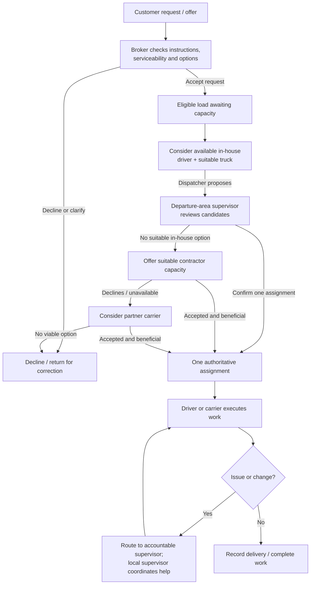
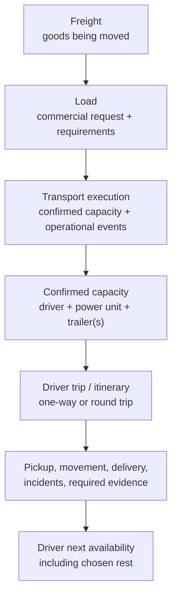
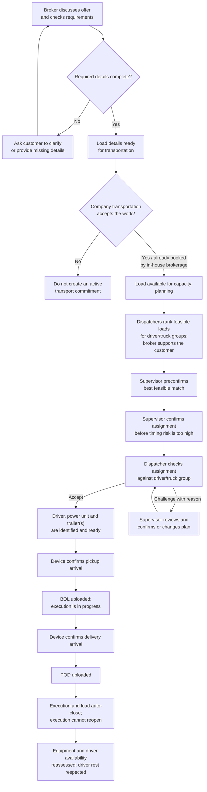

# Load workflow

## The basic path

Customer acceptance, capacity secured, and operational assignment are
different decisions. Accepting a request does not imply capacity is secured.
A dispatcher nomination does not reserve a load or truck; supervisor
confirmation creates one authoritative assignment and closes competing
nominations. If no dispatcher proposes eligible in-house capacity, the
supervisor may assign or request a proposal.

## Core work concepts

Keep these concepts separate:

- **Freight** is the physical goods being transported. A load describes the
  requested movement of that freight; it is not the freight itself.
- **Load** holds the customer/source, pickup and delivery locations,
  appointments and timing, freight/commodity and equipment requirements,
  relevant contact, and commercial instructions. Preserve its revisions from
  booking through delivery.
- **Transport execution** records how the load is carried out: confirmed
  capacity, progress, operational changes, incidents, and delivery evidence.
  Changes to customer requirements are preserved as load revisions;
  execution events link to the relevant revision without replacing the
  load's requirements. Post-delivery questions or feedback belong on the load
  record, not the closed execution.
- **Role-specific information:** brokers work from the load record;
  dispatchers and drivers work from the execution; supervisors can see both.
  Only customer-safe status and operational summaries needed for service are
  copied from execution to the load. These may include status, current
  location, on-time state, and an incident's customer-relevant reason and
  resolution. Equipment identifiers, paperwork, technical details, and
  internal notes remain in the execution.
- **Trip/itinerary** describes a driver's planned sequence of movement and
  can be linked to one or more load executions. A one-way/round-trip label
  describes direction/return plan; short/mid/long describes distance or
  duration. These are independent classifications.
- **Capacity assignment** links a driver to a power unit and one or more
  compatible trailers for an execution. A truck's location alone does not
  establish driver availability.

Do not merge multiple customer loads merely because a driver performs them
as a short round-trip or a customer pays for them as one round-trip package.
An extra-short round-trip may have special commercial treatment while
remaining distinct from a long round-trip. The proposed accountability rule
is that the supervisor for the first pickup area owns an extra-short
round-trip, even if another pickup occurs on the return and the vehicle
enters another area. Validate exact boundaries and commercial treatment
later.

An in-house broker's booking means the customer-side work is booked and
capacity must be sourced; it does not itself assign or make a carrier-side
commitment. For a load offered by an outside broker/customer, the area
supervisor decides whether the company's transportation operation accepts
it. Once accepted by the company, a broker remains responsible for customer
support and communication, regardless of who originated the load.

The broker's acceptance of the customer's commercial offer and the company's
decision to commit transportation capacity are separate decisions. For
in-house brokerage, booking starts capacity sourcing; for an external offer,
the supervisor makes the carrier-side acceptance decision after load
readiness is established.

## Successful transportation path

The successful case means the company accepts only work it intends to
service; every active load has one accountable supervisor and one
authoritative capacity assignment; required pickup and delivery records are
captured; and the driver is not assumed available again until their schedule,
chosen rest, and equipment status support it. Customer feedback is not a
condition of completion.

When the dispatcher challenges a proposed assignment, the supervisor
resolves it before dispatch rather than treating silence as acceptance.
The driver is notified but does not accept or confirm the load in the system.
The dispatcher is responsible for knowing the driver's previously reported
readiness and for ranking only feasible work.

For loads requiring a return toward LA, the next feasible load can be
planned before the current execution ends. This is especially important
before a driver reaches the prior destination. Planning/preconfirmation is
not a requirement that the driver continue working: protected rest remains
the driver's choice and must be respected.

The load and execution close automatically when the POD is received. The
execution is immutable after closure and cannot be reopened. The closed load
may still receive later customer questions, comments, or corrections; these
are appended to its record without reopening the execution. Preserve load
revisions and execution events so the final assigned capacity and delivery
result remain traceable.

## Load readiness and operational record

Before the load enters capacity confirmation, the broker checks that the
customer's instructions are clear enough to transport safely and meet the
commitment. The exact field checklist is determined by freight, route,
equipment, and applicable requirements; research will define it rather than
assuming one universal form. The readiness check must establish that:

- Required legal rules and customer requirements are met for the particular
  freight and movement; inapplicable requirements are not imposed.
- Freight, truck, and trailer suitability and safety have been checked.
- The driver is healthy, legally eligible, and qualified for any special
  freight or handling requirement.
- Pickup and delivery locations, facilities, appointments, and time
  commitments are specified. Preserve exact customer-mandated choices;
  where alternatives are allowed, the broker can select a feasible
  location/window against capacity and secure appointments.
- Customer contacts, operating instructions, access constraints, and other
  details needed to perform the movement are available.

Missing or ambiguous requirements return to the customer for clarification
before capacity is committed. The matching process applies the researched
requirements relevant to that load and excludes non-applicable checks.
Preserve customer requirements separately from appointment choices and
later revisions.

The execution log records operational facts and evidence:

- At pickup and delivery, record arrival, service start, and service end
  times where applicable. Attach the bill of lading (BOL) at pickup and the
  proof of delivery (POD) at delivery.
- Device location, not a driver's self-reported arrival claim, establishes
  arrival at pickup or delivery. Until the device indicates arrival at the
  location, do not change the execution to pickup or delivery status.
- On BOL/POD upload, record the paperwork's pickup/delivery start time as
  the corresponding arrival/start time. Compare that time with the
  device-established arrival: a small discrepancy can prompt a device check;
  a large discrepancy is investigated with dispatch and the relevant
  facility when needed. The acceptable interval is still to be defined.
- A significant delay or discrepancy must be reported by the driver to
  dispatch, even if the facility continues to load or unload. Dispatch keeps
  the customer informed through the broker. Communication is relevant
  context in review; no automatic driver score or disciplinary outcome is
  defined here.
- Device-confirmed pickup arrival changes status to **Pickup**; BOL receipt
  changes it to **In progress**. Device-confirmed delivery arrival changes
  status to **Delivery**; POD receipt changes it to **Finished/Completed**
  and automatically closes both the load and execution.
- Record loading/unloading service start and end times to distinguish wait
  time from service duration.
- A customer may be granted access to permitted log-book events when the
  company chooses to expose them; internal operational notes are not
  automatically customer-visible.
- These timestamps preserve actual dwell and transit duration and support
  later review of delay or detention claims; they do not by themselves
  determine fault or entitlement.
- Dispatch monitors the driver log and obtains a progress update about once
  or twice daily, unless reliable automation supplies it. Automation is a
  later implementation choice.

If an incident is reported, the driver contacts dispatch and dispatch
records the known facts on the execution. Notify the accountable
departure-area supervisor and the supervisor for the incident area when
different; the broker copies only customer-relevant status, reason, and
resolution to the load and communicates verified updates. If a required
supervisor acknowledgement is not received within the agreed interval,
dispatch follows up directly. The interval and incident-specific response
procedure remain to be defined.

## Driver and equipment availability

Availability has two distinct parts:

- **Technical eligibility:** equipment is serviceable and the driver is
  legally and operationally eligible to begin the next assignment, including
  required rest and available driving hours. Reassess after delivery.
- **Driver-reported readiness:** the driver states before assignment how
  much of their guaranteed rest they plan to take and reports any additional
  need that affects readiness. The dispatcher uses this information when
  ranking loads. A load must not be confirmed on the assumption that the
  driver will forgo protected rest.
- **Scheduled time off:** do not assign new loads to a driver on a known day
  off. An unexpected absence removes the driver from new capacity planning
  and follows the applicable exception process.

These checks happen at different times: declared readiness informs
pre-assignment planning; technical eligibility is checked again after the
prior delivery. If a driver's health or readiness changes unexpectedly,
dispatch records the change, the supervisor coordinates the operational
response, and the broker keeps the customer informed. Finding replacement
capacity or changing the commitment belongs to the later exception workflow.
The dispatcher team covers a dispatcher who is off; no load assignment
depends on an off-duty dispatcher being available.

## Contract capacity in the successful path

Contract drivers and their dedicated dispatchers follow the same operational
milestones as in-house capacity where the agreement supports it: assignment,
notification, pickup, progress, incidents, delivery, and POD. Contract
capacity remains lower priority when sourcing a load, but once committed,
the company tracks the execution and customer communication through
completion. Contract rates are required when comparing their capacity.
Responsibility for vehicle/driver costs or cargo loss is governed by the
applicable agreement and is outside this workflow.

A loaded contract truck with a known next location and availability may be
ranked for a later load, much like an in-house truck. Contract capacity has
no preconfirmation stage: once the next assignment is accepted and
confirmed, neither that assignment nor its truck is swapped as part of
ordinary optimization. If the truck completes delivery without a confirmed
next assignment, its dispatcher must explicitly return it to the candidate
pool before it can be ranked for nearby loads. Handling crashes, refusals,
and other contract failures is deferred.

## Availability and capacity priority

- In-house availability is about the **driver**, not merely a truck's
  location. Drivers need their agreed rest time and may take it where they
  are. An idle or nearby truck does not make its driver available.
- Treat driver schedule/rest, legal eligibility, and truck condition as
  separate facts. A truck defect may make a driver/truck pairing unsuitable,
  but does not automatically impose a fixed or fractional availability
  penalty. The detailed effect of an issue on future availability remains
  undefined.
- When alternatives compete and it benefits the company, the proposed
  preference is: suitable in-house capacity, then lease-agreement/
  owner-operator capacity, then partner carrier.
- Company benefit includes suitable coverage and strategic presence beyond
  the strongest local market, not just immediate rate or trip length. Do not
  force a priority order if it breaks timing, customer requirements,
  agreements, or sensible economics. If no option works, decline or cancel
  under the applicable terms.
- For company-owned fleet distribution, use a provisional target of at least
  10% and no more than 50% of the fleet in each non-homeland area. Homeland
  is exempt from the upper bound because trucks return there. Whether
  presence is measured by truck count, and over what time window, remains
  open; the percentages are a planning guardrail, not a forecast.
- Apply hard constraints before preferences: safety/legal eligibility,
  driver-guaranteed rest, load/equipment compatibility, and customer
  commitments define what is feasible. Among feasible choices, the supervisor
  balances company benefit and area/homeward positioning with dispatcher
  load rankings and driver trip preferences. Preferences help choose; they do
  not override a hard constraint or make an unconfirmed proposal binding.
- If multiple in-house trucks remain equally strong after feasibility,
  company/area priorities, and dispatcher rankings are applied, preconfirm
  one at random. Random selection resolves an exact tie; it does not bypass
  the established priorities.
- If a contractor declines, release the reservation and return the load to
  sourcing. After delivery, a contractor may not be nominated for a reload
  until the broker selects it from the unassigned pool.
- Exact assignment, reassignment, and cancellation windows come from the
  applicable customer instructions, appointment, and agreement; there is no
  universal cutoff in this model.

## Regional working assumptions

- **West:** faster turnover; make primary assignment decisions quickly and
  allow less discretionary reassignment. Do not spend effort sourcing
  contractors/partners when beneficial in-house capacity is available.
- **East:** fewer daily loads and longer journeys allow more deliberate
  decisions and closer attention to contractor/partner options. Up to two
  assignment rounds (initial choice plus one reconsideration) may be allowed
  only when deadlines leave time.
- **Central and LA:** their distinct decision cadences remain to be defined.
- **West broker split (proposed):** one broker focuses mainly on outgoing
  loads; the other mainly brings trucks toward LA and also handles outgoing
  loads. The return-focused broker activates incoming sourcing when about
  two-thirds of the fleet is outside the LA-area “homeland,” starting with
  West and continuing until outward deployment can resume. The denominator,
  homeland boundary, and stop condition remain to be defined.
- Geographic presence may justify a suitable lower-rate load when it
  maintains service outside the strongest market.

## One-time versus dedicated work

A one-time load is a single customer movement. A dedicated program is a
recurring lane, schedule, or capacity commitment that produces individual
loads. Each execution still needs an accountable assignment and handoffs.
For dedicated work, assign the program to a dispatcher who already manages
spot drivers when feasible; route each successive load to that dispatcher
and use their available dedicated drivers first. If none can cover a load,
the dispatcher may add a driver or change the dedicated group. A dispatch
team may grow to about 15 drivers, including dedicated drivers. If the
dedicated contract ends, its drivers return to spot work without changing
dispatchers. The dispatcher is dedicated to the work only if staffing
requires it; the program does not automatically require a separate
dispatcher or exclusive trucks.
